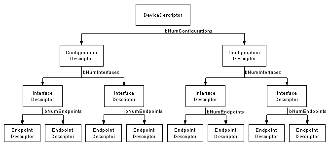

----------
## ***USB***

-----------
Most of my words quote 

[USB Introduction](https://beyondlogic.org/usbnutshell/usb1.shtml#Introduction)

USB version 1.1 supported two speeds, a full speed mode of 12Mbits/s and a low speed mode of 1.5Mbits/s. The 1.5Mbits/s mode is slower and less susceptible to EMI, thus reducing the cost of ferrite beads and quality components. For example, crystals can be replaced by cheaper resonators. USB 2.0 which is still yet to see day light on mainstream desktop computers has upped the stakes to 480Mbits/s. The 480Mbits/s is known as High Speed mode and was a tack on to compete with the Firewire Serial Bus.

USB Speeds
High Speed - 480Mbits/s
Full Speed - 12Mbits/s
Low Speed - 1.5Mbits/s
The Universal Serial Bus is host controlled. There can only be one host per bus. The specification in itself, does not support any form of multimaster arrangement. However the On-The-Go specification which is a tack on standard to USB 2.0 has introduced a Host Negotiation Protocol which allows two devices negotiate for the role of host. This is aimed at and limited to single point to point connections such as a mobile phone and personal organiser and not multiple hub, multiple device desktop configurations. The USB host is responsible for undertaking all transactions and scheduling bandwidth. Data can be sent by various transaction methods using a token-based protocol.

In my view the bus topology of USB is somewhat limiting. One of the original intentions of USB was to reduce the amount of cabling at the back of your PC. Apple people will say the idea came from the Apple Desktop Bus, where both the keyboard, mouse and some other peripherals could be connected together (daisy chained) using the one cable.

However USB uses a tiered star topology, simular to that of 10BaseT Ethernet. This imposes the use of a hub somewhere, which adds to greater expense, more boxes on your desktop and more cables. However it is not as bad as it may seem. Many devices have USB hubs integrated into them. For example, your keyboard may contain a hub which is connected to your computer. Your mouse and other devices such as your digital camera can be plugged easily into the back of your keyboard. Monitors are just another peripheral on a long list which commonly have in-built hubs.

This tiered star topology, rather than simply daisy chaining devices together has some benefits. Firstly power to each device can be monitored and even switched off if an overcurrent condition occurs without disrupting other USB devices. Both high, full and low speed devices can be supported, with the hub filtering out high speed and full speed transactions so lower speed devices do not receive them.

Up to 127 devices can be connected to any one USB bus at any one given time. Need more devices? - simply add another port/host. While most earlier USB hosts had two ports, most manufacturers have seen this as limiting and are starting to introduce 4 and 5 port host cards with an internal port for hard disks etc. The early hosts had one USB controller and thus both ports shared the same available USB bandwidth. As bandwidth requirements grew, we are starting to see multi-port cards with two or more controllers allowing individual channels.

The USB host controllers have their own specifications. With USB 1.1, there were two Host Controller Interface Specifications, UHCI (Universal Host Controller Interface) developed by Intel which puts more of the burden on software (Microsoft) and allowing for cheaper hardware and the OHCI (Open Host Controller Interface) developed by Compaq, Microsoft and National Semiconductor which places more of the burden on hardware(Intel) and makes for simpler software. Typical hardware / software engineer relationship. . .

With the introduction of USB 2.0 a new Host Controller Interface Specification was needed to describe the register level details specific to USB 2.0. The EHCI (Enhanced Host Controller Interface) was born. Significant Contributors include Intel, Compaq, NEC, Lucent and Microsoft so it would hopefully seem they have pooled together to provide us one interface standard and thus only one new driver to implement in our operating systems. Its about time.

USB as its name would suggest is a serial bus. It uses 4 shielded wires of which two are power (+5v & GND). The remaining two are twisted pair differential data signals. It uses a NRZI (Non Return to Zero Invert) encoding scheme to send data with a sync field to synchronise the host and receiver clocks.

USB supports plugnplug with dynamically loadable and unloadable drivers. The user simply plugs the device into the bus. The host will detect this addition, interrogate the newly inserted device and load the appropriate driver all in the time it takes the hourglass to blink on your screen provided a driver is installed for your device. The end user needs not worry about terminations, terms such as IRQs and port addresses, or rebooting the computer. Once the user is finished, they can simply lug the cable out, the host will detect its absence and automatically unload the driver.

The loading of the appropriate driver is done using a PID/VID (Product ID/Vendor ID) combination. The VID is supplied by the USB Implementor's forum at a cost and this is seen as another sticking point for USB. The latest info on fees can be found on the USB Implementors Website

Other standards organisations provide a extra VID for non-commercial activities such as teaching, research or fiddling (The Hobbyist). The USB Implementors forum has yet to provide this service. In these cases you may wish to use one assigned to your development system's manufacturer. For example most chip manufacturers will have a VID/PID combination you can use for your chips which is known not to exist as a commercial device. Other chip manufacturers can even sell you a PID to use with their VID for your commercial device.

Another more notable feature of USB, is its transfer modes. USB supports Control, Interrupt, Bulk and Isochronous transfers. While we will look at the other transfer modes later, Isochronous allows a device to reserve a defined amount of bandwidth with guaranteed latency. This is ideal in Audio or Video applications where congestion may cause loss of data or frames to drop. Each transfer mode provides the designer trade-offs in areas such as error detection and recovery, guaranteed latency and bandwidth.

### Entering Suspend Mode

A USB device will enter suspend when there is no activity on the bus for greater than 3.0ms. It then has a further 7ms to shutdown the device and draw no more than the designated suspend current and thus must be only drawing the rated suspend current from the bus 10mS after bus activity stopped. In order to maintain connected to a suspended hub or host, the device must still provide power to its pull up speed selection resistors during suspend.

USB has a start of frame packet or keep alive sent periodically on the bus. This prevents an idle bus from entering suspend mode in the absence of data.

A high speed bus will have micro-frames sent every 125.0 µs 62.5 ns.
A full speed bus will have a frame sent down each 1.000 ms 500 ns.
A low speed bus will have a keep alive which is a EOP (End of Packet) every 1ms only in the absence of any low speed data.
The term "Global Suspend" is used when the entire USB bus enters suspend mode collectively. However selected devices can be suspended by sending a command to the hub that the device is connected too. This is referred to as a "Selective Suspend."

The device will resume operation when it receives any non idle signalling. If a device has remote wakeup enabled then it may signal to the host to resume from suspend.

----------

## USB Descriptors

USB Descriptors
All USB devices have a hierarchy of descriptors which describe to the host information such as what the device is, who makes it, what version of USB it supports, how many ways it can be configured, the number of endpoints and their types etc.

The more common USB descriptors are

	Device Descriptors
	Configuration Descriptors
	Interface Descriptors
	Endpoint Descriptors
	String Descriptors

USB devices can only have one device descriptor. The device descriptor includes information such as what USB revision the device complies to, the Product and Vendor IDs used to load the appropriate drivers and the number of possible configurations the device can have. The number of configurations indicate how many configuration descriptors branches are to follow.

The configuration descriptor specifies values such as the amount of power this particular configuration uses, if the device is self or bus powered and the number of interfaces it has. When a device is enumerated, the host reads the device descriptors and can make a decision of which configuration to enable. It can only enable one configuration at a time.

For example, It is possible to have a high power bus powered configuration and a self powered configuration. If the device is plugged into a host with a mains power supply, the device driver may choose to enable the high power bus powered configuration enabling the device to be powered without a connection to the mains, yet if it is connected to a laptop or personal organiser it could enable the 2nd configuration (self powered) requiring the user to plug your device into the power point.

The configuration settings are not limited to power differences. Each configuration could be powered in the same way and draw the same current, yet have different interface or endpoint combinations. However it should be noted that changing the configuration requires all activity on each endpoint to stop. While USB offers this flexibility, very few devices have more than 1 configuration.

---------

Interface descriptor could be seen as a header or grouping of the endpoints into a functional group performing a single feature of the device. For example you could have a multi-function fax/scanner/printer device. Interface descriptor one could describe the endpoints of the fax function, Interface descriptor two the scanner function and Interface descriptor three the printer function. Unlike the configuration descriptor, there is no limitation as to having only one interface enabled at a time. A device could have 1 or many interface descriptors enabled at once.

Interface descriptors have a bInterfaceNumber field specifying the Interface number and a bAlternateSetting which allows an interface to change settings on the fly. For example we could have a device with two interfaces, interface one and interface two. Interface one has bInterfaceNumber set to zero indicating it is the first interface descriptor and a bAlternativeSetting of zero.

Interface two would have a bInterfaceNumber set to one indicating it is the second interface and a bAlternativeSetting of zero (default). We could then throw in another descriptor, also with a bInterfaceNumber set to one indicating it is the second interface, but this time setting the bAlternativeSetting to one, indicating this interface descriptor can be an alternative setting to that of the other interface descriptor two.

When this configuration is enabled, the first two interface descriptors with bAlternativeSettings equal to zero is used. However during operation the host can send a SetInterface request directed to that of Interface one with a alternative setting of one to enable the other interface descriptor.

This gives an advantage over having two configurations, in that we can be transmitting data over interface zero while we change the endpoint settings associated with interface one without effecting interface zero.

Each endpoint descriptor is used to specify the type of transfer, direction, polling interval and maximum packet size for each endpoint. Endpoint zero, the default control endpoint is always assumed to be a control endpoint and as such never has a descriptor.

</TABLE>

</UL>
<A NAME="DeviceDescriptors">Device Descriptors</a>
<UL>

<TABLE CELLSPACING=2 CELLPADDING=7 WIDTH=642>
<TR id="head"><TD WIDTH="9%" VALIGN="TOP">
Offset</B></TD>
<TD WIDTH="22%" VALIGN="TOP">
Field</B></TD>
<TD WIDTH="7%" VALIGN="TOP">
Size</B></TD>
<TD WIDTH="12%" VALIGN="TOP">
Value</B></TD>
<TD WIDTH="50%" VALIGN="TOP">
Description</B></TD>
</TR>
<TR id="row"><TD WIDTH="9%" VALIGN="TOP">
0</TD>
<TD WIDTH="22%" VALIGN="TOP">
bLength</TD>
<TD WIDTH="7%" VALIGN="TOP">
1</TD>
<TD WIDTH="12%" VALIGN="TOP">
Number</TD>
<TD WIDTH="50%" VALIGN="TOP">

Size of the Descriptor in Bytes (18 bytes)</TD>
</TR>
<TR id="row"><TD WIDTH="9%" VALIGN="TOP">
1</TD>
<TD WIDTH="22%" VALIGN="TOP">
bDescriptorType</TD>
<TD WIDTH="7%" VALIGN="TOP">
1</TD>
<TD WIDTH="12%" VALIGN="TOP">
Constant</TD>
<TD WIDTH="50%" VALIGN="TOP">

Device Descriptor (0x01)</TD>
</TR>
<TR id="row"><TD WIDTH="9%" VALIGN="TOP">
2</TD>
<TD WIDTH="22%" VALIGN="TOP">
bcdUSB</TD>
<TD WIDTH="7%" VALIGN="TOP">
2</TD>
<TD WIDTH="12%" VALIGN="TOP">
BCD</TD>
<TD WIDTH="50%" VALIGN="TOP">

USB Specification Number which device complies too.</TD>
</TR>
<TR id="row"><TD WIDTH="9%" VALIGN="TOP">
4</TD>
<TD WIDTH="22%" VALIGN="TOP">
bDeviceClass</TD>
<TD WIDTH="7%" VALIGN="TOP">
1</TD>
<TD WIDTH="12%" VALIGN="TOP">
Class</TD>
<TD WIDTH="50%" VALIGN="TOP">

Class Code (Assigned by USB Org)

If equal to Zero, each interface specifies its own class code

If equal to 0xFF, the class code is vendor specified.

Otherwise field is valid Class Code.</TD>
</TR>
<TR id="row"><TD WIDTH="9%" VALIGN="TOP">
5</TD>
<TD WIDTH="22%" VALIGN="TOP">
bDeviceSubClass</TD>
<TD WIDTH="7%" VALIGN="TOP">
1</TD>
<TD WIDTH="12%" VALIGN="TOP">
SubClass</TD>
<TD WIDTH="50%" VALIGN="TOP">

Subclass Code (Assigned by USB Org)</TD>
</TR>
<TR id="row"><TD WIDTH="9%" VALIGN="TOP">
6</TD>
<TD WIDTH="22%" VALIGN="TOP">
bDeviceProtocol</TD>
<TD WIDTH="7%" VALIGN="TOP">
1</TD>
<TD WIDTH="12%" VALIGN="TOP">
Protocol</TD>
<TD WIDTH="50%" VALIGN="TOP">

Protocol Code (Assigned by USB Org)</TD>
</TR>
<TR id="row"><TD WIDTH="9%" VALIGN="TOP">
7</TD>
<TD WIDTH="22%" VALIGN="TOP">
bMaxPacketSize</TD>
<TD WIDTH="7%" VALIGN="TOP">
1</TD>
<TD WIDTH="12%" VALIGN="TOP">
Number</TD>
<TD WIDTH="50%" VALIGN="TOP">

Maximum Packet Size for Zero Endpoint. Valid Sizes are 8, 16, 32, 64</TD>
</TR>
<TR id="row"><TD WIDTH="9%" VALIGN="TOP">
8</TD>
<TD WIDTH="22%" VALIGN="TOP">
idVendor</TD>
<TD WIDTH="7%" VALIGN="TOP">
2</TD>
<TD WIDTH="12%" VALIGN="TOP">
ID</TD>
<TD WIDTH="50%" VALIGN="TOP">

Vendor ID (Assigned by USB Org)</TD>
</TR>
<TR id="row"><TD WIDTH="9%" VALIGN="TOP">
10</TD>
<TD WIDTH="22%" VALIGN="TOP">
idProduct</TD>
<TD WIDTH="7%" VALIGN="TOP">
2</TD>
<TD WIDTH="12%" VALIGN="TOP">
ID</TD>
<TD WIDTH="50%" VALIGN="TOP">

Product ID (Assigned by Manufacturer)</TD>
</TR>
<TR id="row"><TD WIDTH="9%" VALIGN="TOP">
12</TD>
<TD WIDTH="22%" VALIGN="TOP">
bcdDevice</TD>
<TD WIDTH="7%" VALIGN="TOP">
2</TD>
<TD WIDTH="12%" VALIGN="TOP">
BCD</TD>
<TD WIDTH="50%" VALIGN="TOP">

Device Release Number</TD>
</TR>
<TR id="row"><TD WIDTH="9%" VALIGN="TOP">
14</TD>
<TD WIDTH="22%" VALIGN="TOP">
iManufacturer</TD>
<TD WIDTH="7%" VALIGN="TOP">
1</TD>
<TD WIDTH="12%" VALIGN="TOP">
Index</TD>
<TD WIDTH="50%" VALIGN="TOP">

Index of Manufacturer String Descriptor</TD>
</TR>
<TR id="row"><TD WIDTH="9%" VALIGN="TOP">
15</TD>
<TD WIDTH="22%" VALIGN="TOP">
iProduct</TD>
<TD WIDTH="7%" VALIGN="TOP">
1</TD>
<TD WIDTH="12%" VALIGN="TOP">
Index</TD>
<TD WIDTH="50%" VALIGN="TOP">

Index of Product String Descriptor</TD>
</TR>
<TR id="row"><TD WIDTH="9%" VALIGN="TOP">
16</TD>
<TD WIDTH="22%" VALIGN="TOP">
iSerialNumber</TD>
<TD WIDTH="7%" VALIGN="TOP">
1</TD>
<TD WIDTH="12%" VALIGN="TOP">
Index</TD>
<TD WIDTH="50%" VALIGN="TOP">

Index of Serial Number String Descriptor</TD>
</TR>
<TR id="row"><TD WIDTH="9%" VALIGN="TOP">
17</TD>
<TD WIDTH="22%" VALIGN="TOP">
bNumConfigurations</TD>
<TD WIDTH="7%" VALIGN="TOP">
1</TD>
<TD WIDTH="12%" VALIGN="TOP">
Integer</TD>
<TD WIDTH="50%" VALIGN="TOP">

Number of Possible Configurations</TD>
</TR>
</TABLE>

</UL>
<A NAME="ConfigurationDescriptors">Device Descriptors</a>
<UL>
<TABLE CELLSPACING=2 CELLPADDING=7 WIDTH=642>
<TR id="head"><TD WIDTH="8%" VALIGN="TOP">
Offset</B></TD>
<TD WIDTH="22%" VALIGN="TOP">
Field</B></TD>
<TD WIDTH="7%" VALIGN="TOP">
Size</B></TD>
<TD WIDTH="12%" VALIGN="TOP">
Value</B></TD>
<TD WIDTH="50%" VALIGN="TOP">
Description</B></TD>
</TR>
<TR id="row"><TD WIDTH="8%" VALIGN="TOP">
0</TD>
<TD WIDTH="22%" VALIGN="TOP">
bLength</TD>
<TD WIDTH="7%" VALIGN="TOP">
1</TD>
<TD WIDTH="12%" VALIGN="TOP">
Number</TD>
<TD WIDTH="50%" VALIGN="TOP">

Size of Descriptor in Bytes</TD>
</TR>
<TR id="row"><TD WIDTH="8%" VALIGN="TOP">
1</TD>
<TD WIDTH="22%" VALIGN="TOP">
bDescriptorType</TD>
<TD WIDTH="7%" VALIGN="TOP">
1</TD>
<TD WIDTH="12%" VALIGN="TOP">
Constant</TD>
<TD WIDTH="50%" VALIGN="TOP">

Configuration Descriptor (0x02)</TD>
</TR>
<TR id="row"><TD WIDTH="8%" VALIGN="TOP">
2</TD>
<TD WIDTH="22%" VALIGN="TOP">
wTotalLength</TD>
<TD WIDTH="7%" VALIGN="TOP">
2</TD>
<TD WIDTH="12%" VALIGN="TOP">
Number</TD>
<TD WIDTH="50%" VALIGN="TOP">

Total length in bytes of data returned</TD>
</TR>
<TR id="row"><TD WIDTH="8%" VALIGN="TOP">
4</TD>
<TD WIDTH="22%" VALIGN="TOP">
bNumInterfaces</TD>
<TD WIDTH="7%" VALIGN="TOP">
1</TD>
<TD WIDTH="12%" VALIGN="TOP">
Number</TD>
<TD WIDTH="50%" VALIGN="TOP">

Number of Interfaces</TD>
</TR>
<TR id="row"><TD WIDTH="8%" VALIGN="TOP">
5</TD>
<TD WIDTH="22%" VALIGN="TOP">
bConfigurationValue</TD>
<TD WIDTH="7%" VALIGN="TOP">
1</TD>
<TD WIDTH="12%" VALIGN="TOP">
Number</TD>
<TD WIDTH="50%" VALIGN="TOP">

Value to use as an argument to select this configuration</TD>
</TR>
<TR id="row"><TD WIDTH="8%" VALIGN="TOP">
6</TD>
<TD WIDTH="22%" VALIGN="TOP">
iConfiguration</TD>
<TD WIDTH="7%" VALIGN="TOP">
1</TD>
<TD WIDTH="12%" VALIGN="TOP">
Index</TD>
<TD WIDTH="50%" VALIGN="TOP">

Index of String Descriptor describing this configuration</TD>
</TR>
<TR id="row"><TD WIDTH="8%" VALIGN="TOP">
7</TD>
<TD WIDTH="22%" VALIGN="TOP">
bmAttributes</TD>
<TD WIDTH="7%" VALIGN="TOP">
1</TD>
<TD WIDTH="12%" VALIGN="TOP">
Bitmap</TD>
<TD WIDTH="50%" VALIGN="TOP">

D7 Reserved, set to 1. (USB 1.0 Bus Powered)

D6 Self Powered

D5 Remote Wakeup

D4..0 Reserved, set to 0.</TD>
</TR>
<TR id="row"><TD WIDTH="8%" VALIGN="TOP">
8</TD>
<TD WIDTH="22%" VALIGN="TOP">
bMaxPower</TD>
<TD WIDTH="7%" VALIGN="TOP">
1</TD>
<TD WIDTH="12%" VALIGN="TOP">
mA</TD>
<TD WIDTH="50%" VALIGN="TOP">

Maximum Power Consumption in 2mA units </TD>
</TR>
</TABLE>

Interface Descriptor

<TABLE CELLSPACING=2 CELLPADDING=7 WIDTH=642>
<TR id="head"><TD WIDTH="8%" VALIGN="TOP">
Offset</B></TD>
<TD WIDTH="22%" VALIGN="TOP">
Field</B></TD>
<TD WIDTH="7%" VALIGN="TOP">
Size</B></TD>
<TD WIDTH="12%" VALIGN="TOP">
Value</B></TD>
<TD WIDTH="50%" VALIGN="TOP">
Description</B></TD>
</TR>
<TR id="row"><TD WIDTH="8%" VALIGN="TOP">
0</TD>
<TD WIDTH="22%" VALIGN="TOP">
bLength</TD>
<TD WIDTH="7%" VALIGN="TOP">
1</TD>
<TD WIDTH="12%" VALIGN="TOP">
Number</TD>
<TD WIDTH="50%" VALIGN="TOP">

Size of Descriptor in Bytes (9 Bytes)</TD>
</TR>
<TR id="row"><TD WIDTH="8%" VALIGN="TOP">
1</TD>
<TD WIDTH="22%" VALIGN="TOP">
bDescriptorType</TD>
<TD WIDTH="7%" VALIGN="TOP">
1</TD>
<TD WIDTH="12%" VALIGN="TOP">
Constant</TD>
<TD WIDTH="50%" VALIGN="TOP">

Interface Descriptor (0x04)</TD>
</TR>
<TR id="row"><TD WIDTH="8%" VALIGN="TOP">
2</TD>
<TD WIDTH="22%" VALIGN="TOP">
bInterfaceNumber</TD>
<TD WIDTH="7%" VALIGN="TOP">
1</TD>
<TD WIDTH="12%" VALIGN="TOP">
Number</TD>
<TD WIDTH="50%" VALIGN="TOP">

Number of Interface</TD>
</TR>
<TR id="row"><TD WIDTH="8%" VALIGN="TOP">
3</TD>
<TD WIDTH="22%" VALIGN="TOP">
bAlternateSetting</TD>
<TD WIDTH="7%" VALIGN="TOP">
1</TD>
<TD WIDTH="12%" VALIGN="TOP">
Number</TD>
<TD WIDTH="50%" VALIGN="TOP">

Value used to select alternative setting</TD>
</TR>
<TR id="row"><TD WIDTH="8%" VALIGN="TOP">
4</TD>
<TD WIDTH="22%" VALIGN="TOP">
bNumEndpoints</TD>
<TD WIDTH="7%" VALIGN="TOP">
1</TD>
<TD WIDTH="12%" VALIGN="TOP">
Number</TD>
<TD WIDTH="50%" VALIGN="TOP">

Number of Endpoints used for this interface</TD>
</TR>
<TR id="row"><TD WIDTH="8%" VALIGN="TOP">
5</TD>
<TD WIDTH="22%" VALIGN="TOP">
bInterfaceClass</TD>
<TD WIDTH="7%" VALIGN="TOP">
1</TD>
<TD WIDTH="12%" VALIGN="TOP">
Class</TD>
<TD WIDTH="50%" VALIGN="TOP">

Class Code (Assigned by USB Org)</TD>
</TR>
<TR id="row"><TD WIDTH="8%" VALIGN="TOP">
6</TD>
<TD WIDTH="22%" VALIGN="TOP">
bInterfaceSubClass</TD>
<TD WIDTH="7%" VALIGN="TOP">
1</TD>
<TD WIDTH="12%" VALIGN="TOP">
SubClass</TD>
<TD WIDTH="50%" VALIGN="TOP">

Subclass Code (Assigned by USB Org)</TD>
</TR>
<TR id="row"><TD WIDTH="8%" VALIGN="TOP">
7</TD>
<TD WIDTH="22%" VALIGN="TOP">
bInterfaceProtocol</TD>
<TD WIDTH="7%" VALIGN="TOP">
1</TD>
<TD WIDTH="12%" VALIGN="TOP">
Protocol</TD>
<TD WIDTH="50%" VALIGN="TOP">

Protocol Code (Assigned by USB Org)</TD>
</TR>
<TR id="row"><TD WIDTH="8%" VALIGN="TOP">
8</TD>
<TD WIDTH="22%" VALIGN="TOP">
iInterface</TD>
<TD WIDTH="7%" VALIGN="TOP">
1</TD>
<TD WIDTH="12%" VALIGN="TOP">
Index</TD>
<TD WIDTH="50%" VALIGN="TOP">

Index of String Descriptor Describing this interface</TD>
</TR>
</TABLE>

Endpoint Descriptor

<TABLE CELLSPACING=2 CELLPADDING=7 WIDTH=642>
<TR id="head"><TD WIDTH="9%" VALIGN="TOP">
Offset</B></TD>
<TD WIDTH="22%" VALIGN="TOP">
Field</B></TD>
<TD WIDTH="7%" VALIGN="TOP">
Size</B></TD>
<TD WIDTH="12%" VALIGN="TOP">
Value</B></TD>
<TD WIDTH="50%" VALIGN="TOP">
Description</B></TD>
</TR>
<TR id="row"><TD WIDTH="9%" VALIGN="TOP">
0</TD>
<TD WIDTH="22%" VALIGN="TOP">
bLength</TD>
<TD WIDTH="7%" VALIGN="TOP">
1</TD>
<TD WIDTH="12%" VALIGN="TOP">
Number</TD>
<TD WIDTH="50%" VALIGN="TOP">

Size of Descriptor in Bytes (7 bytes)</TD>
</TR>
<TR id="row"><TD WIDTH="9%" VALIGN="TOP">
1</TD>
<TD WIDTH="22%" VALIGN="TOP">
bDescriptorType</TD>
<TD WIDTH="7%" VALIGN="TOP">
1</TD>
<TD WIDTH="12%" VALIGN="TOP">
Constant</TD>
<TD WIDTH="50%" VALIGN="TOP">

Endpoint Descriptor (0x05)</TD>
</TR>
<TR id="row"><TD WIDTH="9%" VALIGN="TOP">
2</TD>
<TD WIDTH="22%" VALIGN="TOP">
bEndpointAddress</TD>
<TD WIDTH="7%" VALIGN="TOP">
1</TD>
<TD WIDTH="12%" VALIGN="TOP">
Endpoint</TD>
<TD WIDTH="50%" VALIGN="TOP">
Endpoint Address 
Bits 0..3b Endpoint Number. 
Bits 4..6b Reserved. Set to Zero 
Bits 7     Direction 0 = Out, 1 = In (Ignored for Control Endpoints) 
</TD>
</TR>
<TR id="row"><TD WIDTH="9%" VALIGN="TOP">
3</TD>
<TD WIDTH="22%" VALIGN="TOP">
bmAttributes</TD>
<TD WIDTH="7%" VALIGN="TOP">
1</TD>
<TD WIDTH="12%" VALIGN="TOP">
Bitmap</TD>
<TD WIDTH="50%" VALIGN="TOP">

Bits 0..1 Transfer Type
<UL>
00 = Control 
01 = Isochronous 
10 = Bulk 
11 = Interrupt 
</UL>
Bits 2..7 are reserved. If Isochronous endpoint,  
Bits 3..2 = Synchronisation Type (Iso Mode)
<UL>
00 = No Synchonisation 
01 = Asynchronous 
10 = Adaptive 
11 = Synchronous 
</UL>
Bits 5..4 = Usage Type (Iso Mode)
<UL>
00 = Data Endpoint 
01 = Feedback Endpoint 
10 = Explicit Feedback Data Endpoint 
11 = Reserved 
</UL>
</TD>
</TR>
<TR id="row"><TD WIDTH="9%" VALIGN="TOP">
4</TD>
<TD WIDTH="22%" VALIGN="TOP">
wMaxPacketSize</TD>
<TD WIDTH="7%" VALIGN="TOP">
2</TD>
<TD WIDTH="12%" VALIGN="TOP">
Number</TD>
<TD WIDTH="50%" VALIGN="TOP">

Maximum Packet Size this endpoint is capable of sending or receiving</TD>
</TR>
<TR id="row"><TD WIDTH="9%" VALIGN="TOP">
6</TD>
<TD WIDTH="22%" VALIGN="TOP">
bInterval</TD>
<TD WIDTH="7%" VALIGN="TOP">
1</TD>
<TD WIDTH="12%" VALIGN="TOP">
Number</TD>
<TD WIDTH="50%" VALIGN="TOP">

Interval for polling endpoint data transfers. Value in frame counts. Ignored for Bulk &amp; Control Endpoints. Isochronous must equal 1 and field may range from 1 to 255 for interrupt endpoints.</TD>
</TR>
</TABLE>

--------------

### Setup Packet

Every USB device must respond to setup packets on the default pipe. The setup packets are used for detection and configuration of the device and carry out common functions such as setting the USB devices address, requesting a device descriptor or checking the status of a endpoint.

A USB compliant Host expects all requests to be processed within a maximum period of 5 seconds. It also specifies stricter timing for specific requests :

Standard Device requests without a data stage must be completed in 50ms.

Standard Device requests with a data stage must start to return data 500ms after the request.

Each data packet must be sent within 500ms of the successful transmission of the previous packet.
The status stage must complete within 50ms after the transmission of the last data packet.
The SetAddress command (which contains a data phase) must process the command and return status within 50ms. The device then has 2ms to change address before the next request is sent.

These timeout periods are quite acceptable for even the slowest of devices, but can be a restriction during debugging. 50mS doesn't provide for many debugging characters to be sent at 9600bps on an asynchronous serial port or for a In Circuit Debugger/Emulator to single step or to break execution to examine the internal Registers. As a result, USB requires some different debugging methods to that of other microcontroller projects.

Each request starts with a 8 byte long Setup Packet which has the following format,

<TABLE CELLSPACING=2 CELLPADDING=7 WIDTH=536>
<TR id="head"><TD WIDTH="10%" VALIGN="MIDDLE" HEIGHT=24>
Offset</B></TD>
<TD WIDTH="22%" VALIGN="MIDDLE" HEIGHT=24>
Field</B></TD>
<TD WIDTH="8%" VALIGN="MIDDLE" HEIGHT=24>
Size</B></TD>
<TD WIDTH="14%" VALIGN="MIDDLE" HEIGHT=24>
Value</B></TD>
<TD WIDTH="46%" VALIGN="MIDDLE" HEIGHT=24>
Description</B></TD>
</TR>
<TR id="row"><TD VALIGN="TOP">
0</TD>
<TD VALIGN="TOP">
bmRequestType</TD>
<TD VALIGN="TOP">
1</TD>
<TD VALIGN="TOP">
Bit-Map</TD>
<TD VALIGN="TOP">

<B>D7 Data Phase Transfer Direction</B> 
&#9;0 = Host to Device 
&#9;1 = Device to Host 
<B>D6..5 Type</B> 
&#9;0 = Standard 
&#9;1 = Class 
&#9;2 = Vendor 
&#9;3 = Reserved 
<B>D4..0 Recipient</B> 
&#9;0 = Device 
&#9;1 = Interface 
&#9;2 = Endpoint 
&#9;3 = Other 
4..31 = Reserved 
</TD>
</TR>
<TR id="row"><TD VALIGN="MIDDLE">
1</TD>
<TD VALIGN="MIDDLE">
bRequest</TD>
<TD VALIGN="MIDDLE">
1</TD>
<TD VALIGN="MIDDLE">
Value</TD>
<TD VALIGN="MIDDLE">

Request</TD>
</TR>
<TR id="row"><TD VALIGN="MIDDLE" HEIGHT=30>
2</TD>
<TD VALIGN="MIDDLE" HEIGHT=30>
wValue</TD>
<TD VALIGN="MIDDLE" HEIGHT=30>
2</TD>
<TD VALIGN="MIDDLE" HEIGHT=30>
Value</TD>
<TD VALIGN="MIDDLE" HEIGHT=30>

Value</TD>
</TR>
<TR id="row"><TD VALIGN="MIDDLE" HEIGHT=30>
4</TD>
<TD VALIGN="MIDDLE" HEIGHT=30>
wIndex</TD>
<TD VALIGN="MIDDLE" HEIGHT=30>
2</TD>
<TD VALIGN="MIDDLE" HEIGHT=30>
Index or Offset</TD>
<TD VALIGN="MIDDLE" HEIGHT=30>

Index</TD>
</TR>
<TR id="row"><TD VALIGN="MIDDLE" HEIGHT=30>
6</TD>
<TD VALIGN="MIDDLE" HEIGHT=30>
wLength</TD>
<TD VALIGN="MIDDLE" HEIGHT=30>
2</TD>
<TD VALIGN="MIDDLE" HEIGHT=30>
Count</TD>
<TD VALIGN="MIDDLE" HEIGHT=30>

Number of bytes to transfer if there is a data phase</TD>
</TR>
</TABLE>

The bmRequestType field will determine the direction of the request, type of request and designated recipient. The bRequest field determines the request being made. The bmRequestType is normally parsed and execution is branched to a number of handlers such as a Standard Device request handler, a Standard Interface request handler, a Standard Endpoint request handler, a Class Device request handler etc. How you parse the setup packet is entirely up to your preference. Others may choose to parse the bRequest first and then determine the type and recipient based on each request.

Standard requests are common to all USB device's and are detailed in the next coming pages. Class requests are common to classes of drivers. For example, all device conforming to the HID class will have a common set of class specific requests. These will differ to a device conforming to the communications class and differ again to that of a device conforming to the mass storage class.

And last of all are the vendor defined requests. These are requests which you as the USB device designer can assign. These are normally different from device to device, but this is all up to your implementation and imagination.

A common request can be directed to different recipients and based on the recipient perform different functions. A GetStatus Standard request for example, can be directed at the device, interface or endpoint. When directed to a device it returns flags indicating the status of remote wakeup and if the device is self powered. However if the same request is directed at the interface it always returns zero, or should it be directed at an endpoint will return the halt flag for the endpoint.

The wValue and wIndex fields allow parameters to be passed with the request. wLength is used the specify the number of bytes to be transferred should there be a data phase.

### Standard Device Requests

<TABLE CELLSPACING=2 CELLPADDING=7 WIDTH=642>
<TR id="head"><TD WIDTH="17%" VALIGN="TOP">
bmRequestType</B></TD>
<TD WIDTH="24%" VALIGN="TOP">
bRequest</B></TD>
<TD WIDTH="15%" VALIGN="TOP">
wValue</B></TD>
<TD WIDTH="15%" VALIGN="TOP">
wIndex</B></TD>
<TD WIDTH="15%" VALIGN="TOP">
wLength</B></TD>
<TD WIDTH="15%" VALIGN="TOP">
Data</B></TD>
</TR>
<TR id="row"><TD WIDTH="17%" VALIGN="MIDDLE">
1000 0000b </TD>
<TD WIDTH="24%" VALIGN="MIDDLE">
GET_STATUS (0x00)</TD>
<TD WIDTH="15%" VALIGN="MIDDLE">
Zero</TD>
<TD WIDTH="15%" VALIGN="MIDDLE">
Zero </TD>
<TD WIDTH="15%" VALIGN="MIDDLE">
Two</TD>
<TD WIDTH="15%" VALIGN="MIDDLE">
Device Status</TD>
</TR>
<TR id="row"><TD WIDTH="17%" VALIGN="MIDDLE">
0000 0000b</TD>
<TD WIDTH="24%" VALIGN="MIDDLE">
CLEAR_FEATURE (0x01)</TD>
<TD WIDTH="15%" VALIGN="MIDDLE">
Feature Selector</TD>
<TD WIDTH="15%" VALIGN="MIDDLE">
Zero</TD>
<TD WIDTH="15%" VALIGN="MIDDLE">
Zero</TD>
<TD WIDTH="15%" VALIGN="MIDDLE">
None</TD>
</TR>
<TR id="row"><TD WIDTH="17%" VALIGN="MIDDLE">
0000 0000b</TD>
<TD WIDTH="24%" VALIGN="MIDDLE">
SET_FEATURE (0x03)</TD>
<TD WIDTH="15%" VALIGN="MIDDLE">
Feature Selector</TD>
<TD WIDTH="15%" VALIGN="MIDDLE">
Zero</TD>
<TD WIDTH="15%" VALIGN="MIDDLE">
Zero</TD>
<TD WIDTH="15%" VALIGN="MIDDLE">
None</TD>
</TR>
<TR id="row"><TD WIDTH="17%" VALIGN="MIDDLE">

0000 0000b</TD>
<TD WIDTH="24%" VALIGN="MIDDLE">
SET_ADDRESS (0x05)</TD>
<TD WIDTH="15%" VALIGN="MIDDLE">
Device Address</TD>
<TD WIDTH="15%" VALIGN="MIDDLE">
Zero</TD>
<TD WIDTH="15%" VALIGN="MIDDLE">
Zero</TD>
<TD WIDTH="15%" VALIGN="MIDDLE">
None</TD>
</TR>
<TR id="row"><TD WIDTH="17%" VALIGN="MIDDLE">
1000 0000b</TD>
<TD WIDTH="24%" VALIGN="MIDDLE">
GET_DESCRIPTOR (0x06)</TD>
<TD WIDTH="15%" VALIGN="MIDDLE">
Descriptor Type &amp; Index</TD>
<TD WIDTH="15%" VALIGN="MIDDLE">
Zero or Language ID</TD>
<TD WIDTH="15%" VALIGN="MIDDLE">
Descriptor Length</TD>
<TD WIDTH="15%" VALIGN="MIDDLE">
Descriptor</TD>
</TR>
<TR id="row"><TD WIDTH="17%" VALIGN="MIDDLE">
0000 0000b</TD>
<TD WIDTH="24%" VALIGN="MIDDLE">
SET_DESCRIPTOR (0x07)</TD>
<TD WIDTH="15%" VALIGN="MIDDLE">
Descriptor Type &amp; Index</TD>
<TD WIDTH="15%" VALIGN="MIDDLE">
Zero or Language ID</TD>
<TD WIDTH="15%" VALIGN="MIDDLE">
Descriptor Length</TD>
<TD WIDTH="15%" VALIGN="MIDDLE">
Descriptor</TD>
</TR>
<TR id="row"><TD WIDTH="17%" VALIGN="MIDDLE">
1000 0000b</TD>
<TD WIDTH="24%" VALIGN="MIDDLE">
GET_CONFIGURATION (0x08)</TD>
<TD WIDTH="15%" VALIGN="MIDDLE">
Zero</TD>
<TD WIDTH="15%" VALIGN="MIDDLE">
Zero</TD>
<TD WIDTH="15%" VALIGN="MIDDLE">
1</TD>
<TD WIDTH="15%" VALIGN="MIDDLE">
Configuration Value</TD>
</TR>
<TR id="row"><TD WIDTH="17%" VALIGN="MIDDLE">
0000 0000b</TD>
<TD WIDTH="24%" VALIGN="MIDDLE">
SET_CONFIGURATION (0x09)</TD>
<TD WIDTH="15%" VALIGN="MIDDLE">
Configuration Value</TD>
<TD WIDTH="15%" VALIGN="MIDDLE">
Zero</TD>
<TD WIDTH="15%" VALIGN="MIDDLE">
Zero</TD>
<TD WIDTH="15%" VALIGN="MIDDLE">
None</TD>
</TR>
</TABLE>

### Standard Interface Requests

<TABLE CELLSPACING=2 CELLPADDING=7 WIDTH=642>
<TR id="head"><TD WIDTH="17%" VALIGN="TOP">
bmRequestType</B></TD>
<TD WIDTH="24%" VALIGN="TOP">
bRequest</B></TD>
<TD WIDTH="15%" VALIGN="TOP">
wValue</B></TD>
<TD WIDTH="15%" VALIGN="TOP">
wIndex</B></TD>
<TD WIDTH="15%" VALIGN="TOP">
wLength</B></TD>
<TD WIDTH="15%" VALIGN="TOP">
Data</B></TD>
</TR>
<TR id="row"><TD WIDTH="17%" VALIGN="MIDDLE">
1000 0001b</TD>
<TD WIDTH="24%" VALIGN="MIDDLE">
GET_STATUS (0x00)</TD>
<TD WIDTH="15%" VALIGN="MIDDLE">
Zero</TD>
<TD WIDTH="15%" VALIGN="MIDDLE">
Interface</TD>
<TD WIDTH="15%" VALIGN="MIDDLE">
Two</TD>
<TD WIDTH="15%" VALIGN="MIDDLE">
Interface Status</TD>
</TR>
<TR id="row"><TD WIDTH="17%" VALIGN="MIDDLE">
0000 0001b </TD>
<TD WIDTH="24%" VALIGN="MIDDLE">
CLEAR_FEATURE (0x01)</TD>
<TD WIDTH="15%" VALIGN="MIDDLE">
Feature Selector</TD>
<TD WIDTH="15%" VALIGN="MIDDLE">
Interface</TD>
<TD WIDTH="15%" VALIGN="MIDDLE">
Zero</TD>
<TD WIDTH="15%" VALIGN="MIDDLE">
None</TD>
</TR>
<TR id="row"><TD WIDTH="17%" VALIGN="MIDDLE">
0000 0001b</TD>
<TD WIDTH="24%" VALIGN="MIDDLE">
SET_FEATURE (0x03)</TD>
<TD WIDTH="15%" VALIGN="MIDDLE">
Feature Selector</TD>
<TD WIDTH="15%" VALIGN="MIDDLE">
Interface</TD>
<TD WIDTH="15%" VALIGN="MIDDLE">
Zero</TD>
<TD WIDTH="15%" VALIGN="MIDDLE">
None</TD>
</TR>
<TR id="row"><TD WIDTH="17%" VALIGN="MIDDLE">
1000 0001b</TD>
<TD WIDTH="24%" VALIGN="MIDDLE">
GET_INTERFACE (0x0A)</TD>
<TD WIDTH="15%" VALIGN="MIDDLE">
Zero</TD>
<TD WIDTH="15%" VALIGN="MIDDLE">
Interface</TD>
<TD WIDTH="15%" VALIGN="MIDDLE">
One</TD>
<TD WIDTH="15%" VALIGN="MIDDLE">
Alternate Interface</TD>

</TR>
<TR id="row"><TD WIDTH="17%" VALIGN="MIDDLE">
0000 0001b</TD>
<TD WIDTH="24%" VALIGN="MIDDLE">
SET_INTERFACE (0x11)</TD>
<TD WIDTH="15%" VALIGN="MIDDLE">
Alternative Setting</TD>
<TD WIDTH="15%" VALIGN="MIDDLE">
Interface</TD>
<TD WIDTH="15%" VALIGN="MIDDLE">
Zero</TD>
<TD WIDTH="15%" VALIGN="MIDDLE">
None</TD>
</TR>
</TABLE>

### Standard Endpoint Requests

<TABLE CELLSPACING=2 CELLPADDING=7 WIDTH=642>
<TR id="head"><TD WIDTH="17%" VALIGN="TOP">
bmRequestType</B></TD>
<TD WIDTH="24%" VALIGN="TOP">
bRequest</B></TD>
<TD WIDTH="15%" VALIGN="TOP">
wValue</B></TD>
<TD WIDTH="15%" VALIGN="TOP">
Windex</B></TD>
<TD WIDTH="15%" VALIGN="TOP">
wLength</B></TD>
<TD WIDTH="15%" VALIGN="TOP">
Data</B></TD>
</TR>
<TR id="row"><TD WIDTH="17%" VALIGN="MIDDLE">
1000 0010b</TD>
<TD WIDTH="24%" VALIGN="MIDDLE">
GET_STATUS (0x00)</TD>
<TD WIDTH="15%" VALIGN="MIDDLE">
Zero</TD>
<TD WIDTH="15%" VALIGN="MIDDLE">
Endpoint</TD>
<TD WIDTH="15%" VALIGN="MIDDLE">
Two</TD>
<TD WIDTH="15%" VALIGN="MIDDLE">
Endpoint Status</TD>
</TR>
<TR id="row"><TD WIDTH="17%" VALIGN="MIDDLE">
0000 0010b</TD>
<TD WIDTH="24%" VALIGN="MIDDLE">
CLEAR_FEATURE (0x01)</TD>
<TD WIDTH="15%" VALIGN="MIDDLE">
Feature Selector</TD>
<TD WIDTH="15%" VALIGN="MIDDLE">
Endpoint</TD>
<TD WIDTH="15%" VALIGN="MIDDLE">
Zero</TD>
<TD WIDTH="15%" VALIGN="MIDDLE">
None</TD>
</TR>
<TR id="row"><TD WIDTH="17%" VALIGN="MIDDLE">
0000 0010b</TD>
<TD WIDTH="24%" VALIGN="MIDDLE">
SET_FEATURE (0x03)</TD>
<TD WIDTH="15%" VALIGN="MIDDLE">
Feature Selector</TD>
<TD WIDTH="15%" VALIGN="MIDDLE">
Endpoint</TD>
<TD WIDTH="15%" VALIGN="MIDDLE">
Zero</TD>
<TD WIDTH="15%" VALIGN="MIDDLE">
None</TD>
</TR>
<TR id="row"><TD WIDTH="17%" VALIGN="MIDDLE">
1000 0010b</TD>
<TD WIDTH="24%" VALIGN="MIDDLE">
SYNCH_FRAME (0x12)</TD>
<TD WIDTH="15%" VALIGN="MIDDLE">
Zero</TD>
<TD WIDTH="15%" VALIGN="MIDDLE">
Endpoint</TD>
<TD WIDTH="15%" VALIGN="MIDDLE">
Two</TD>
<TD WIDTH="15%" VALIGN="MIDDLE">
FrameNumber</TD>
</TR>
</TABLE>

