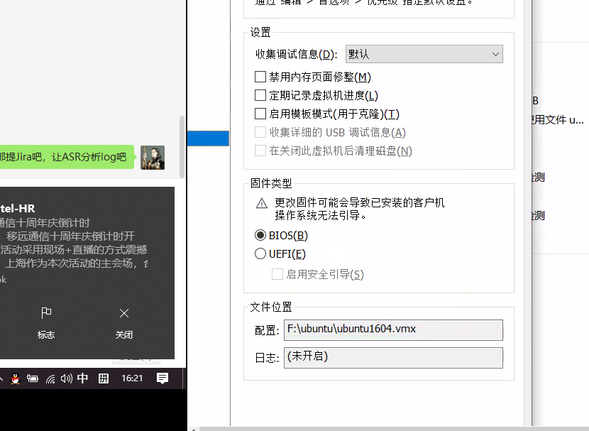

To the superior this section customer ignores, suggests the customer to check the compilation error by itself

Ubuntu 

All the tools and driver source code Quectel releases have been verified on mainstream Liunx systems, from kernel 2.6 to the latest kernel versions, but there are cases where the customer has encountered problems during compilation.

### SecureBoot

	modprobe: unsigned module loading is restricted; see man kernel_lockdown.7

rootcause:
	
[SecureBoot](https://unix.stackexchange.com/questions/543576/modprobe-fails-with-operation-not-permitted)

### 

### Stdarg.h

You might meet this: 

Add this into Makefile:
	ccflags-y = -Wno-declaration-after-statement -mpopcnt -I/usr/lib/gcc/x86_64-linux-gnu/5.4.0/include

###

###

###

