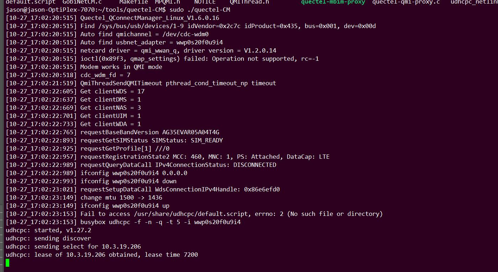

#quectel-CM 

- Check quectel-CM and the port driver version.The latest drivers and tools are required. Problems encountered with older versions of the test are not handled.

- Confirm the status of injection network. The quectel-CM log print contains the SIM card status and network status.

- APN inspection.Check APN carefully for Internet of Things card, private network card and special network card.Let's find out what APN is going to be issued by the network in the case of null APN.

- DHCP Client tool. It is recommended to use udhcpc or busybox udhcpc. Quectel-CM also supports dhclient. To use dhclient, modify the source file udhcpc.c, by openning the micro "#define USE_DHCPCLIENT". On Ubuntu or Centos PC platform, it is recommended to use dhclient.

- The Udhcpc default script cannot be opened in Windows. Execute DOS2UNIX default.script and chmod 777 default.script on Ubuntu and copy them to the embedded platform.

- The default default.script is usually in "/usr/share/udhcpc" and "/etc/udhcpc". It is recommended to make a copy of both.

- If the client USES default.script instead of the default.script in the quectel-CM, try using the default.script in the quectel-CM

- Default.script the Udhcpc has the -s option to specify default.script.

- Encountered ioctl and ptheread_cond_timeout_NP such log, generally is QMI not.The -v option for CM allows you to print QMI messages, providing logs like this.It is necessary to submit usbmon and modem log for further analysis.

- Quectel-cm and ModemManger have conflicts. Try "apt remove -- purge modemmanger". Modemmanger is available by default on both Debian and Centos classes.Some modules (EC2X) support ModemManger dialing, 5G unverified.

- Specify the quectel-CM in one specified PID file. Just open this micro "CONFIG_PID_FILE_FORMAT" in main.c.

### COMMON Issue

You will see log as follow:

There will be no more log later.

There are some things you should check:

	1.modemmanager

	2.There is a valid default.script for udhcpc
		- It is /etc/udhcpc/default.script but not /usr/share/udhcpc/default.script
		- The default.script has invisble characters. dos2unix default.script
		- No execution permission. chmod +w default.script
 
	3.On Ubuntu/Centos PC, it's recommended and easier to use dhclient.
