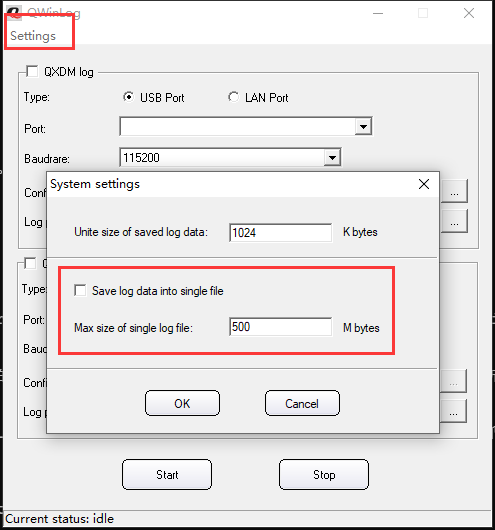
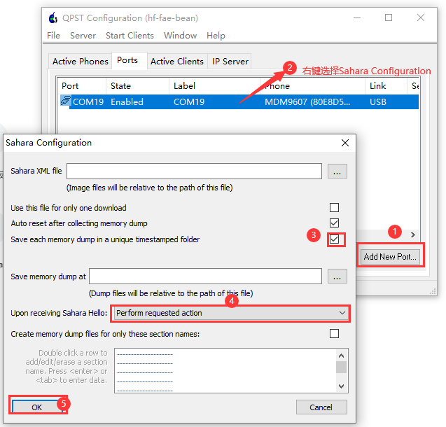

# 抓log

一些未知原因导致模组功能异常，需要抓取log。包括

	Modem log （又称QLog、QXDM log）
	Dump log
	Demsg log （Host AP侧，Host Driver log）
	tcpdump
	usb log （又称usbmon log）
	Android RIL log
	模组AP的AP kernel log（模组的debug port log）

多数情况下，涉及模块、注网、网络等情况的问题需要抓modem log，涉及工具、驱动有关的，还需要抓Host侧的dmesg log和usb log。

## Modem log

Windows和Linux/Android 分别使用不同的工具。

抓Modem log之前，执行AT指令 
	
	AT+QCFG="dbgctl",0

打开模块的debug 功能，否则抓到的log可能会不全。（5G模组暂不需要, 如果该指令执行报错也可以忽略，对老模块和新开发的模块不需要）

### Windows 

Windows OS 用QWinlog。

将Quectel 模组连上Windows机器，Type选择USB Port, Port选择DM port，Bandrate选择默认的115200。Config file，对不同的场景和模组选择不同cfg文件。

LTE模组生成的目标文件的扩展名是bin,5G模组生成的目标文件是*.qmdl2，同时还有数据库文件扩展名为qdb。将所有的bin、qmdl2还有qdb文件一起打包发送给Quectel FAE

QXDM 也可以抓Modem log，但是QXDM需要Qualcomm License，不直接提供客户。FAE到客户现场，可以用QXDM直接抓取log。

抓log的操作

	1.启动QWinLog，选择正确的Port、Bandrate、Config file后，点击Start
	2.开始复现问题
	3.点击Stop结束
	4.合并log。settings->Merge log files
	5.将合并后的log和qdb文件一起打包

注意：

> 默认不开启Save log into single file, 因此最终产生的log会是许多log文件组成，最后由用户选择Merge成一个目标log文件。如果用户选择了Save log into single file, 最终会只有1个log文件产生，注意还有该文件的大小限制Max size of single log file.

> Merge log时候注意log的时间顺序，按照实际产生的顺序点击Add.

对高通和ASR平台均可使用QWinLog.

### Linux

Linux系统，移远提供了抓包工具的源码，需要将该源码编译成可执行的二进制文件，在目标平台上运行。
gcc（或者arm-linux-gcc）版本较低时，Makefile中加上-lrt。
对Android系统，可以通过源码编译，也可以使用预先编译好的可执行文件，QLog的压缩包和RIL的压缩包中均有QAndroidLog。

QLog的使用

	root@q-K501LB:/home/q/Driver_Tools_Quectel/QLog# ./QLog --help
	[000.000] QLog Version: Quectel_QLog_Linux&Android_V1.5
	./QLog: invalid option -- '-'
	[000.000] Usage: ./QLog -p <log port> -s <log save dir> -f filter_cfg -n <log file max num> -b <log file size MBytes>
	[000.000] Default: ./QLog -p /dev/ttyUSB0 -s . -n 512 -b 128 to save log to local disk
	[000.000]     -p    The port to catch log (default '/dev/ttyUSB0')
	[000.000]     -s    Dir to save log, default is '.'
	[000.000]           if set as '9000', QLog will run in TCP Server Mode, and can be connected with 'QPST/QWinLog/CATStudio'!
	[000.000]     -f    filter cfg for catch log, can be found in directory 'conf'. if not set this arg, will use default filter conf
	[000.000]           and UC200T&EC200T do not need filter cfg.
	[000.000]     -n    max num of log file to save, range is '0~512'. default is 0. 0 means no limit.
	[000.000]           or QLog will auto delete oldtest log file if exceed max num
	[000.000]     -m    max size of single log file, unit is MBytes, range is '2~512', default is 128
	[000.000]     -q    Exit after usb disconnet
	[000.000]
	For example: ./QLog -s .

其中值得的关注的有
	
	-p 选择DM port, 用于选择多个Quectel模组之一抓log的情况；
	-s 选择log的保存位置，如果不加该选择，模组保存在当前位置；如果设置成9000，QLog工作在TCP Server 模组，log保存在远程TCP Client那（可以是QPST/QEWinLog），用于嵌入式系统存储空间不足，log过大的情况，下面会有详细操作介绍。
	-f 指定cfg文件，和QWinLog这方面功能相同，选择不同的cfg，抓取出来的log的内容、大小会有区别。

QLog 可以放在后台运行

	root@q-K501LB:/home/q/Driver_Tools_Quectel/QLog# ./QLog &
	[000.000] QLog Version: Quectel_QLog_Linux&Android_V1.5
	[000.000] will use filter file: default filter
	[000.101] Find [0] idVendor=2c7c, idProduct=0125, bNumInterfaces=6, ttyDM=/dev/ttyUSB0, busnum=001, dev=006, usbdevice_pah=/sys/bus/usb/devices/1-3
	[000.102] open /dev/ttyUSB0 ttyfd = 3
	[000.102] Press CTRL+C to stop catch log.
	[000.102] catch log via tty port
	[000.106] qlog_logfile_create qlog_files/20201117_111415_0000.qmdl logfd=4
	[000.510] qlog_init_filter_finished
	[005.273] recv: 0M 322K 68B  in 5171 msec
	[010.382] recv: 0M 415K 949B  in 5109 msec
	...

抓取到的log，包括qmdl2和，一起打包发送给Quectel。

### TCP抓发

嵌入式系统的rom空间较小，如果条件允许，客户可以通过接U盘等方式，将log保存在U盘等外部rom上。但是如果客户设备无法外接U盘/tf卡，但是该设备上有以太网接口或者无线接口，可以在该嵌入式平台上运行QLog，将log保存到局域网里的另外一台Windows OS的机器上。
结构如图所示

同时QWinLog配置成TCP Client,如下

## Dump log

抓dump log，需要先配置模组的AP和modem不能出现故障的时候重启。执行AT指令

	at+qcfg="aprstlevel",0
	at+qcfg="modemrstlevel",0

这两条指令是立即生效，执行后不要重启模组。

在模组进dump状态后，会只有一个ttyUSB0保留。

	[615118.980180] usb 5-1.1: USB disconnect, device number 74
	[615118.980281] option1 ttyUSB2: usb_wwan_indat_callback: resubmit read urb failed. (-19)
	[615118.989125] option1 ttyUSB2: usb_wwan_indat_callback: resubmit read urb failed. (-19)
	[615118.998270] option1 ttyUSB2: usb_wwan_indat_callback: resubmit read urb failed. (-19)
	[615119.007248] option1 ttyUSB2: usb_wwan_indat_callback: resubmit read urb failed. (-19)
	[615119.018900] option1 ttyUSB0: GSM modem (1-port) converter now disconnected from ttyUSB0
	[615119.019127] option 5-1.1:1.0: device disconnected
	[615119.019630] option1 ttyUSB1: GSM modem (1-port) converter now disconnected from ttyUSB1
	[615119.019716] option 5-1.1:1.1: device disconnected
	[615119.021831] option1 ttyUSB2: GSM modem (1-port) converter now disconnected from ttyUSB2
	[615119.021933] option 5-1.1:1.2: device disconnected
	[615119.022408] option1 ttyUSB3: GSM modem (1-port) converter now disconnected from ttyUSB3
	[615119.026133] option 5-1.1:1.3: device disconnected
	[615119.027902] qmi_wwan 5-1.1:1.4 wwan0: unregister 'qmi_wwan' usb-xhci-hcd.0.auto-1.1, WWAN/QMI device
	[615119.470116] CPU Budget:update CPU 0 cpufreq max to 1488000 min to 480000
	[615119.470152] CPU Budget hotplug: cluster0 min:0 max:4
	[615119.730432] usb 5-1.1: new high-speed USB device number 75 using xhci-hcd
	[615119.750874] usb 5-1.1: New USB device found, idVendor=2c7c, idProduct=0435
	[615119.750898] usb 5-1.1: New USB device strings: Mfr=1, Product=2, SerialNumber=0
	[615119.750916] usb 5-1.1: Product: QHSUSB__BULK
	[615119.750933] usb 5-1.1: Manufacturer: Qualcomm CDMA Technologies MSM
	[615119.781007] option 5-1.1:1.0: GSM modem (1-port) converter detected
	[615119.781877] usb 5-1.1: GSM modem (1-port) converter now attached to ttyUSB0

Windows的设备管理器中只有一个USB串口。

### Windows用QPST抓dump
	
at+qcfg="ModemRstlevel",0

at+qcfg="ApRstlevel",0

后启动QPST，按照下图顺序执行

	
### Linux运行QLog
	
	
	./QLog -s dump
	
	[000.000]QLog Version: LTE_QLog_Linux&Android_V1.5.0
	[000.001]open /dev/ttyUSB0 ttyfd = 3
	[000.002]qlog_get_vidpid_by_ttyport idVendor=2c7c, idProduct=0435, bNumInterfaces= 1
	
	[000.003]Press CTRL+C to stop catch log.
	[000.003]STATE <-- SAHARA_WAIT_HELLO
	[000.003]Read 8 bytes, command 1 and packet length 48 bytes
	[000.003]RECEIVED <--  SAHARA_HELLO_ID
	[000.003]RECEIVED <-- SAHARA_MODE_MEMORY_DEBUG
	[000.003]SENDING --> SAHARA_HELLO_RESPONSE
	[000.003]STATE <-- SAHARA_WAIT_COMMAND
	[000.004]Read 8 bytes, command 9 and packet length 16 bytes
	[000.004]RECEIVED <-- SAHARA_MEMORY_DEBUG_ID
	...
	
	[025.417]SENDING --> SAHARA_RESET
	[025.417]STATE <-- SAHARA_WAIT_RESET_RESP
	[025.418]Read 8 bytes, command 8 and packet length 8 bytes
	[025.418]RECEIVED <-- SAHARA_RESET_RESP_ID
	[025.535]Read/Write File descriptor returned error: No such file or directory, error code 0
	[025.536]Get reset response code 8
	[025.537]Sahara protocol completed
	[025.537]Catch DUMP using Sahara protocol successful

	root@cqh6:~/qlog_new# du -sh dump/*
	128K	dump/CODERAM.BIN
	64K	dump/DATARAM.BIN
	256M	dump/DDRCS0.BIN
	20K	dump/MSGRAM.BIN
	16K	dump/OCIMEM.BIN
	4.0K	dump/PMIC_PON.BIN
	4.0K	dump/RST_STAT.BIN
	4.0K	dump/load.cmm

### 手动让模组dump的方法

- AT指令 at+qtest="dump",1 
- 硬件方法。咨询QuectelFAE

## Host Side dmesg log

dmesg命令用于打印Linux系统开机启动信息,kernel会将开机信息存储在ring buffer中.

dmesg | grep usb

## usb log

[Kernel Document](https://elixir.bootlin.com/linux/v5.10-rc4/source/Documentation/usb/usbmon.rst)

usbmon 是内核自带的一个模块，可以收集usb总线上的数据。
usbmon也是tcpdump、usbdump、USBmon这些应用层的工具的功能之一。

### debugfs

嵌入式系统可能默认并不支持debugfs，也不会把usbmon编译进去。首先检查是否支持debugfs，内核是否开启了usbmon功能。

Step 1: 检查内核是否支持debugfs

> 内核版本 >= 3.11

	Kernel hacking -->
	    Compile-time checks and compiler options -->
	        Debug Filesystem

> 内核版本 < 3.11

	Kernel hacking -->
	    Debug Filesystem

在目标.config中检查

	CONFIG_DEBUG_FS=y

在目标机器上检查

root@q-K501LB:/# cat /proc/filesystems | grep debugfs
nodev   debugfs

再挂载debugfs

	mount -t debugfs none /sys/kernel/debug

Step 2: usbmon

menuconfig中

	Device Drivers -->
	    USB support -->
	        USB Monitor  (Built-in)

目标.config

	CONFIG_USB_MON=m

目标机器上

	/sys/kernel/debug/usb/usbmon/

Step 3：判断usb bus

确认模块在哪一条usb总线上，方法包括

	lsusb
	dmesg log
	cat /sys/kernel/debug/usb/devices

Step 4: 抓log

切换到 /sys/kernel/debug/usb/usbmon 目录下，有如下文件

	0s 0u 1s 1t 1u 2s 2t 2u 3s 3t 3u 4s 4t 4u

模块挂在哪个Bus上，譬如模组在Bus 3上，就

	cat 3u > /tmp/usbmon_log.txt

	0s 0u 1s 1t 1u 2s 2t 2u 3s 3t 3u 4s 4t 4u

1、2、3、4代表usb总线号，0代表所有的usb总线。模块连接在ubuntu的第3条usb总线上，因此 cat 3u 。

s、t、u表示输出的usbmon log的format，其中u输出的信息最详细，因此使用u结尾的文件。

### tcpdump 抓usb log

cat /sys/kernel/debug/usb/usbmon 的方式抓包的时候，有个缺点，只能显示前40个字节。
要想抓全部的数据，可以用tcpdump来抓。
而且用tcpdump抓的数据，可以用wireshark工具来解析，wireshard能分析常用的协议，非常方便。

步骤如下:
- Step 1: 和前面一样，确认系统有usbmon驱动和 debugfs.

- Step 2: tcpdump D 可以显示可以抓包的设备
	
	
	root@q-K501LB$: tcpdump -D
	
	1.wlan0 [Up, Running]
	
	2.lo [Up, Running, Loopback]
	
	3.any (Pseudo-device that captures on all interfaces) [Up, Running]
	
	4.eth0 [Up]

	5.bluetooth-monitor (Bluetooth Linux Monitor) [none]
	
	6.nflog (Linux netfilter log (NFLOG) interface) [none]
	
	7.nfqueue (Linux netfilter queue (NFQUEUE) interface) [none]
	
	8.bluetooth0 (Bluetooth adapter number 0) [none]
	
	9.usbmon0 (Raw USB traffic, all USB buses) [none]
	
	10.usbmon1 (Raw USB traffic, bus number 1)

	11.usbmon2 (Raw USB traffic, bus number 2)
	
	12.wwan0 [none]

- Step 3: 抓包，并保存到数据到文件中
	
	tcpdump -i usbmon1 -w usbmon.pcap &
	
- Step 4: Killall tcpdump，并用wireshard打开抓到的文件usbmon.pcap。 

## tcpdump 网络包

根据使用者的定义对网络上的数据包进行截获的包分析工具。

监视指定网络接口的数据包
	

	tcpdump -i eth1

Wireshark(以前是ethereal)是Windows下非常简单易用的抓包工具。但在Linux下很难找到一个好用的图形化抓包工具。
还好有Tcpdump。我们可以用Tcpdump + Wireshark 的完美组合实现：在 Linux 里抓包，然后在Windows 里分析包。

tcpdump tcp -i eth1 -t -s 0 -c 100 and dst port ! 22 and src net 192.168.1.0/24 -w ./target.cap

	(1)tcp: ip icmp arp rarp 和 tcp、udp、icmp这些选项等都要放到第一个参数的位置，用来过滤数据报的类型
	(2)-i eth1 : 只抓经过接口eth1的包
	(3)-t : 不显示时间戳
	(4)-s 0 : 抓取数据包时默认抓取长度为68字节。加上-S 0 后可以抓到完整的数据包
	(5)-c 100 : 只抓取100个数据包
	(6)dst port ! 22 : 不抓取目标端口是22的数据包
	(7)src net 192.168.1.0/24 : 数据包的源网络地址为192.168.1.0/24
	(8)-w ./target.cap : 保存成cap文件，方便用ethereal(即wireshark)分析

:)
