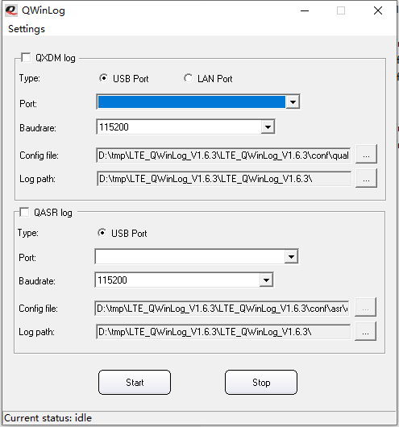

# 抓log

一些未知原因导致模组功能异常，需要抓取log。包括

	Modem log （又称QLog、QXDM log）
	Dump log
	Demsg log （Host AP侧，Host Driver log）
	tcpdump
	usb log （又称usbmon log）
	Android RIL log
	模组AP的AP kernel log（模组的debug port log）

多数情况下，涉及模块、注网、网络等情况的问题需要抓modem log，涉及工具、驱动有关的，还需要抓Host侧的dmesg log和usb log。

## Modem log

Windows和Linux/Android 分别使用不同的工具。

### Windows 

Windows OS 用QWinlog。

将Quectel 模组连上Windows机器，Type选择USB Port, Port选择DM port，Bandrate选择默认的115200。Config file，对不同的场景和模组选择不同cfg文件。
生成的目标文件是*.qmdl2。

QXDM 也可以抓Modem log，但是QXDM需要Qualcomm License，不直接提供客户。FAE到客户现场，可以用QXDM直接抓取log。

### Linux

Linux系统，移远提供了抓包工具的源码，需要将该源码编译成可执行的二进制文件，在目标平台上运行。
gcc（或者arm-linux-gcc）版本较低时，Makefile中加上-lrt。
对Android系统，可以通过源码编译，也可以使用预先编译好的可执行文件，QLog的压缩包和RIL的压缩包中均有QAndroidLog。

QLog的使用

	root@q-K501LB:/home/q/Driver_Tools_Quectel/QLog# ./QLog --help
	[000.000] QLog Version: Quectel_QLog_Linux&Android_V1.5
	./QLog: invalid option -- '-'
	[000.000] Usage: ./QLog -p <log port> -s <log save dir> -f filter_cfg -n <log file max num> -b <log file size MBytes>
	[000.000] Default: ./QLog -p /dev/ttyUSB0 -s . -n 512 -b 128 to save log to local disk
	[000.000]     -p    The port to catch log (default '/dev/ttyUSB0')
	[000.000]     -s    Dir to save log, default is '.'
	[000.000]           if set as '9000', QLog will run in TCP Server Mode, and can be connected with 'QPST/QWinLog/CATStudio'!
	[000.000]     -f    filter cfg for catch log, can be found in directory 'conf'. if not set this arg, will use default filter conf
	[000.000]           and UC200T&EC200T do not need filter cfg.
	[000.000]     -n    max num of log file to save, range is '0~512'. default is 0. 0 means no limit.
	[000.000]           or QLog will auto delete oldtest log file if exceed max num
	[000.000]     -m    max size of single log file, unit is MBytes, range is '2~512', default is 128
	[000.000]     -q    Exit after usb disconnet
	[000.000]
	For example: ./QLog -s .

其中值得的关注的有
	
	-p 选择DM port, 用于选择多个Quectel模组之一抓log的情况；
	-s 选择log的保存位置，如果不加该选择，模组保存在当前位置；如果设置成9000，QLog工作在TCP Server 模组，log保存在远程TCP Client那（可以是QPST/QEWinLog），用于嵌入式系统存储空间不足，log过大的情况，下面会有详细操作介绍。
	-f 指定cfg文件，和QWinLog这方面功能相同，选择不同的cfg，抓取出来的log的内容、大小会有区别。

QLog 可以放在后台运行

	root@q-K501LB:/home/q/Driver_Tools_Quectel/QLog# ./QLog &
	[000.000] QLog Version: Quectel_QLog_Linux&Android_V1.5
	[000.000] will use filter file: default filter
	[000.101] Find [0] idVendor=2c7c, idProduct=0125, bNumInterfaces=6, ttyDM=/dev/ttyUSB0, busnum=001, dev=006, usbdevice_pah=/sys/bus/usb/devices/1-3
	[000.102] open /dev/ttyUSB0 ttyfd = 3
	[000.102] Press CTRL+C to stop catch log.
	[000.102] catch log via tty port
	[000.106] qlog_logfile_create qlog_files/20201117_111415_0000.qmdl logfd=4
	[000.510] qlog_init_filter_finished
	[005.273] recv: 0M 322K 68B  in 5171 msec
	[010.382] recv: 0M 415K 949B  in 5109 msec
	...

抓取到的log，包括qmdl2和，一起打包发送给Quectel。

### TCP抓发

嵌入式系统的rom空间较小，如果条件允许，客户可以通过接U盘等方式，将log保存在U盘等外部rom上。但是如果客户设备无法外接U盘/tf卡，但是该设备上有以太网接口或者无线接口，可以在该嵌入式平台上运行QLog，将log保存到局域网里的另外一台Windows OS的机器上。
结构如图所示

同时QWinLog配置成TCP Client,如下

## Dump log

抓dump log，需要先配置模组的AP和modem不能出现故障的时候重启。执行AT指令

	at+qcfg="aprstlevel",0
	at+qcfg="modemrstlevel",0

在模组进dump状态后，会只有一个ttyUSB0保留

运行QLog

	./QLog -s dump

手动让模组dump的方法

- AT指令 at+qtest="dump",1 
- 硬件方法。咨询QuectelFAE

:)
