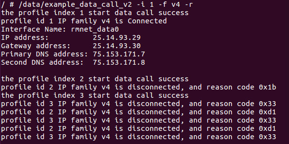

AG35 OPenLinux 网络管理
=======

本文档暂时只包括

- AG35如何通过SIM拨号联网
- 与AG35通过USB连接的Ubuntu机器如何通过ECM网卡联网
- 管理AG35模组上以太网、无线（需要FC20/AF20，未完成）

AG35通过API拨号
-----

AG35上通过API拨号，不用关心usbnet类型。

SDK中提供了拨号的例子

	biao@WB:~/Quectel/EC25E_FC20/ql-ol-sdk/ql-ol-extsdk/example/data$ ls -la
	total 300
	drwxr-xr-x 1 biao biao   512 Dec 30 15:06 .
	drwxr-xr-x 1 biao biao   512 Aug  3 12:41 ..
	-rwxr-xr-x 1 biao biao  2425 Aug  3 12:41 Makefile
	-rwxrwxr-x 1 biao biao 59148 Dec 28 16:28 example_apn_v2
	-rwxr-xr-x 1 biao biao  6118 Aug  3 12:41 example_apn_v2.c
	-rw-rw-r-- 1 biao biao  7472 Dec 28 16:28 example_apn_v2.o
	-rwxrwxr-x 1 biao biao 57528 Dec 28 16:28 example_data_call_v2
	-rwxr-xr-x 1 biao biao  4123 Aug  3 12:41 example_data_call_v2.c
	-rw-rw-r-- 1 biao biao  3928 Dec 28 16:28 example_data_call_v2.o
	-rwxrwxr-x 1 biao biao 60312 Dec 28 16:28 example_data_call_v2_cdma
	-rwxr-xr-x 1 biao biao  8256 Aug  3 12:41 example_data_call_v2_cdma.c
	-rw-rw-r-- 1 biao biao  8916 Dec 28 16:28 example_data_call_v2_cdma.o
	-rwxrwxr-x 1 biao biao 56832 Dec 28 16:28 example_default_profile
	-rwxr-xr-x 1 biao biao  1811 Aug  3 12:41 example_default_profile.c
	-rw-rw-r-- 1 biao biao  2988 Dec 28 16:28 example_default_profile.o
	drwxr-xr-x 1 biao biao   512 Aug  3 12:41 leagcy

example_data_call_v2 这个例子默认是拨1-3路。拨号成功后，3路成功的话，应该有3个rmnet_dataX获取到IP地址，并且用AT+CGPADDR查到的地址与 rmnet_dataX 地址相同。

遇到这种情况，第二路和第三路拨号失败的情况，

经检查 第二路和第三路 的APN 已经分别用于 ims 和 sos 。

### 默认路由 ###

虽然rmnet_data0 获取IP地址成功，但是依然无法 ping 8.8.8.8 

route -n 发现，系统并没有将rmnet_data0 作为默认路由

	route add default  dev rmnet_data0

### DNS ###

ping 不通域名，尝试加个DNS server

	echo  "nameserver 8.8.8.8" > /etc/resolv.conf 

建议添加运营商基站下发的DNS Server。通过API获取（Ql_Data_Call_Info_Get）

Host 如何联网
-----

AG35 Open模组和一台Ubuntu PC通过USB连接。

如果是标准固件，和前文的标准模组结果相同，USB Interface 4 是网卡设备，匹配网卡驱动。
对AG35，

	Bus 01, Port 1: Dev 1, Class=root_hub, Driver=ehci-pci/6p, 480M
	|__Port 1: Dev 20, If 0, Class=Vendor Specific Class, Driver=option, 480M
	|__Port 1: Dev 20, If 1, Class=Vendor Specific Class, Driver=option, 480M
	|__Port 1: Dev 20, If 2, Class=Vendor Specific Class, Driver=option, 480M
	|__Port 1: Dev 20, If 3, Class=Vendor Specific Class, Driver=option, 480M
	|__Port 1: Dev 20, If 4, Class=Vendor Specific Class, Driver=, 480M
	|__Port 1: Dev 20, If 5, Class=Communications, Driver=cdc_ether, 480M
	|__Port 1: Dev 20, If 6, Class=CDC Data, Driver=cdc_ether, 480M
	|__Port 1: Dev 20, If 7, Class=Vendor Specific Class, Driver=usbfs, 480M

如果用Quectel 提供的qmi_wwan_q驱动，可能还会

	|__Port 1: Dev 20, If 0, Class=Vendor Specific Class, Driver=qmi_wwan_q, 480M

不要以为AG35的 Interface 4 可以用做 rmnet 网卡，以为rmnet 网卡可以和 ECM 网卡共存。

坚持用quectel-CM拨号，发现一直打印，第一条QMI_SYNC 的消息都没发出去

	[12-26_14:16:32:166] QmiWwanThread poll err/hup/inval
	[12-26_14:16:32:166] poll fd = 7, events = 0x0008

Interface 4 用于 客户的新增串口。

接下来对使用 ECM 网卡，实现Ubuntu PC上的联网需求。

执行 busybox udhcpc -i usbX 给usbX 分配 IP地址，并将usbX 添加到默认路由中。usbX 是Ubuntu上cdc_ether 生成的网卡，可能会被grub改变。

注意

- **usbX的IP地址是192.168.225.X**
- **将192.168.225.1设置未为usbX的网关，并添加到操作系统的DNS配置文件中去**

