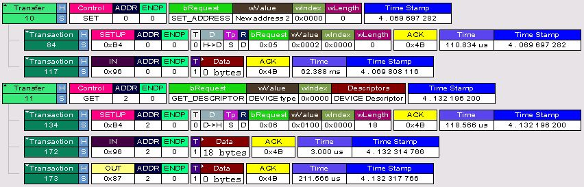

USB零包
=====

QFirehose 升级，报错

	inf[0] ep_in -1/1024, errno = 145 (Connection timed out), timeout=600
	qusb_noblock_read read=0, errno=145 (Connection timed out)

Carl 大神说，需要添加零包支持。

about Zero-length packet
------

[What is zero-length packet?](https://stackoverflow.com/questions/48975323/what-is-zero-length-packet)

Both of the terminologies are used for transaction completion mechanism. The maximum size of data packets can be derived from bMaxPacketSize stored in Endpoint descriptors. When data packet is less than that, its called a Short Packet. Similarly when you can send a data packet with length Zero.

	   /* initialize the urb properly */
	    usb_fill_bulk_urb(urb, dev->udev,
		      usb_sndbulkpipe(dev->udev, dev->bulk_out_endpointAddr),
		      buf, count, lcd_write_bulk_callback, dev);
	    urb->transfer_flags |= URB_NO_TRANSFER_DMA_MAP;
	//如果想传输0字节的包,那么需要加入URB_ZERO_PACKET
	//变为urb->transfer_flags |= URB_NO_TRANSFER_DMA_MAP | URB_ZERO_PACKET;
	    /* send the data out the bulk port */
	    retval = usb_submit_urb(urb, GFP_KERNEL);

	static struct urb *usb_wwan_setup_urb(struct usb_serial *serial, int endpoint,
	int dir, void *ctx, char *buf, int len,void (*callback) (struct urb *))
	{

	    usb_fill_bulk_urb(urb, serial->dev,
	    usb_sndbulkpipe(serial->dev, endpoint) | dir,buf, len, callback, ctx);
	    //Added by Quectel for zero packet
	    if (dir == USB_DIR_OUT) {
	    struct usb_device_descriptor *desc = &serial->dev->descriptor;
	    if (desc->idVendor == cpu_to_le16(0x2C7C) && desc->idProduct == cpu_to_le16(0x0125))
		urb->transfer_flags |= URB_ZERO_PACKET;
	    }
	    //End by Quectel for zero packet
	    return urb;

/*
     * URB_ZERO_PACKET means adding a 0-length packet, if direction
     * is OUT and the transfer_length was an exact multiple of maxsze,
     * hence (len = transfer_length - N * maxsze) == 0
     * however, if transfer_length == 0, the zero packet was already
     * prepared above.
     */

    
    //判断是URB是否设置了URB_ZERO_PACKET.
    //如果该位被置,而且是OUT方向.且数据长度是最大允许长度的整数位
    //就需要传输一个0长度的数据包来结速此次传输

Zero len 包的用途
----

- control传输的最后一个阶段

- bulk out传输发送完maxpacket size后。如果上层软件bulk out传输时在urb->transfer_flags设置了URB_ZERO_PACKET，那么在发送完maxpacket size大小的数据后，会再发送一个零长包代表transfer结束。
