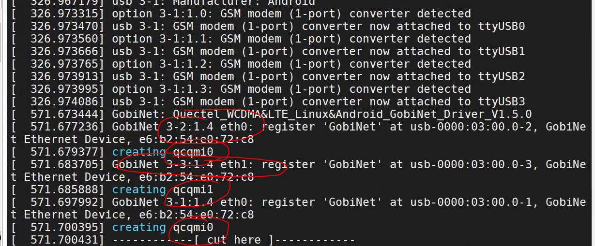
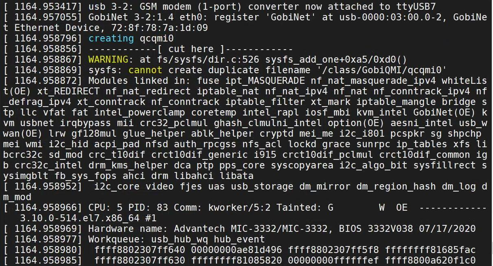
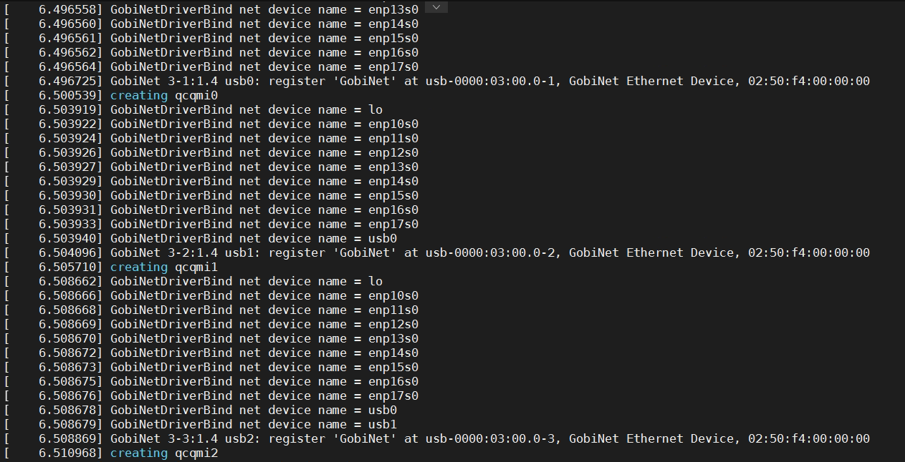
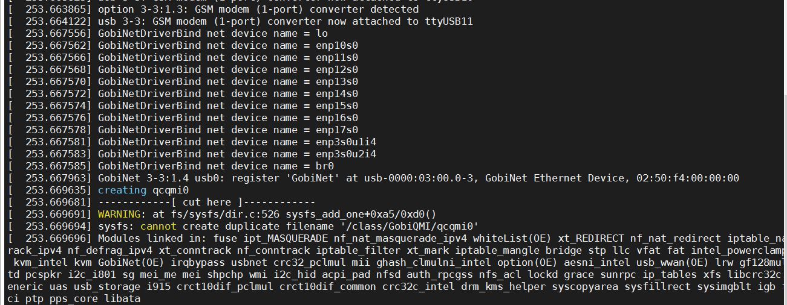

Code Issuses
=====

GobiNet qcqmiX从0计数
----

客户使用CentOS 7，接3片EC20模组，当重启其中一片EC20后，遇到

GobiNetDriverBind
...
	{

		struct net_device*d;
		struct net*net = dev_net(pDev->net);
		for_each_netdev(net,d)
			printk("%s net device name = %s \n",__func__,d->name);
	}

正常的机器

	[418370.783287] creating qcqmi0
	[418370.783831] GobiNetDriverBind net device name = lo
	[418370.783832] GobiNetDriverBind net device name = eth0
	[418370.783833] GobiNetDriverBind net device name = wlan0
	[418370.783834] GobiNetDriverBind net device name = docker0
	[418370.783835] GobiNetDriverBind net device name = usb0

而客户的CentOS上

第一次安装驱动初始化的时候是Ok的

当reset其中一个模组后，读系统中的网卡链表信息

可以看到 网卡名称已经不是usbX，新模组usbX从usb0开始计数，导致qcqmiX序号也是从0开始计数。

