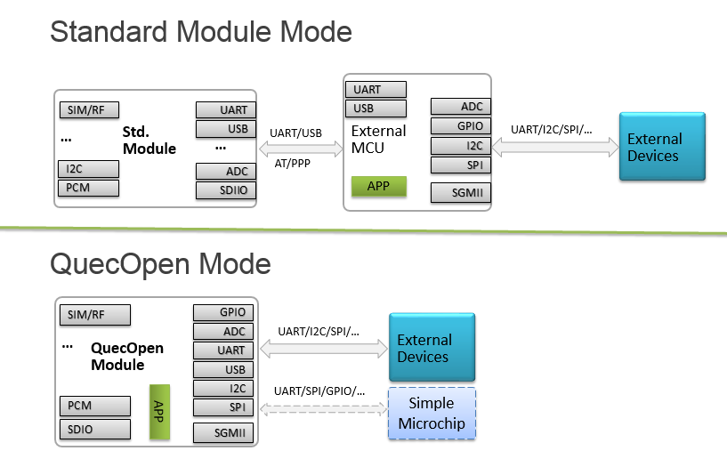

# 模组使用指南

----------

**移远标准模组使用指南**

## Quectel ##

无线通信技术方案供应商。

## What is Quectel Modules ##

由于嵌入式操作系统运行在AP上，有各种外设接口(Uart/SPI/I2C/Audio/SDIO等)，远程模块也可以作为处理器使用。客户可以为一些不需要高处理性能和资源的场景集成和移植外设和应用程序。远程解决方案称为开放解决方案。

Quectel模块一般通过USB/PCIe/Uart连接到另一个嵌入式处理器（称Host AP，或EAP，External AP）。使用远程通信模块作为设备，使用在主机AP上移植模块所需的驱动程序。这种方案称为标准模块方案。

----------
Links:
 
*[`Official Website`](https://www.quectel.com/ "Official Website")*
 
*[`Forums`](https://Forums.quectel.com/ "Forums")*
 
*[`中文论坛`](https://forumschinese.quectel.com/ "中文论坛")*

