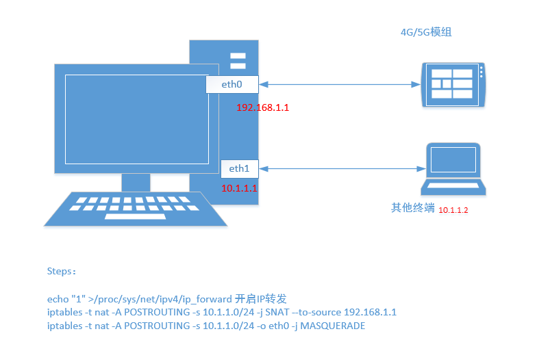
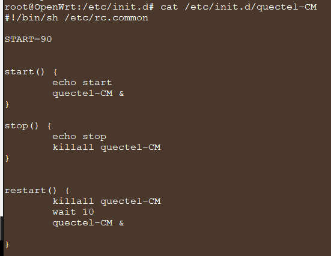

软路由功能
======

目标

主控连接Quectel模组后，主控上的同时还有以太网和无线网卡。无线网卡工作在AP模式，其他设备通过连接该无线网卡的WIFI，可以实现联网功能。以太网网卡也与其他设备连接，其他设备也能通过LTE/5G模组正常联网。

一般来说，实现LTE/5G拨号成功后，同时给连接到客户主控上的WIFI、Ethernet网卡的其他设备提供网络，通常方法包括两种

- NAT
- Bridge

NAT
----

NAT 就是指一种网络共享，ip地址转换的方式。

    
    sysctl net.ipv4.ip_forward=1  // echo 1 > /sys/net/ipv4/ip_forward 

Same like

Bridge
----

to be done

同 tap/tun、veth-pair 一样，Bridge 也是一种虚拟网络设备，所以具备虚拟网络设备的所有特性，比如可以配置 IP、MAC 等。
除此之外，Bridge 还是一个交换机，具有交换机所有的功能。

OpenWrt
----

### OpenWrt 集成Quectel驱动和工具

[OpenWrt 路由器挂载EC20 EC25等4G模组](http://www.10qianwan.com/articledetail/647453.html)

#### patch方式

Linux内核和驱动，还可以用打patch的方式。因为Linux内核和OpenWrt的其他软件包一样，是在编译过程中下载解压的，OpenWrt对这些软件包的修改方法是将这些软件包编译过程中，解压后可以加上用户自己的patch，可以参考

https://blog.csdn.net/sevenjoin/article/details/50767123

下面演示在添加VID、PID的方法，QUILT是OpenWrt的Patch管理工具。

	<1>安装QUILT
	sudo apt-get install quilt
	<2>准备内核源码树
	cd    $(SDK_DIR)     		//进入顶层目录
	make target/linux/{clean,prepare} V=s QUILT=1     
	 //准备内核源码，用于产生原始patch，会将源码恢复到原始状态并打全存在的patch
	<3>进入kernel源码顶层目录
	<4>安装所有的patch - 这一步可以不执行，通常在执行步骤1的时候已经应用了所以的patch了
	quilt push -a     //应用所有的patch， 在当前patches/目录下
	<5>创建新patch，也可以修改已经存在的patch，
	quilt new platform/998-usb-option.patch
	<6>修改源码文件drivers/usb/serial/option.c
	//通过edit打开要编辑的文件并写入修改信息
	<7>查看修改的内容，可通过下面指令：quilt diff
	<8>产生新修改的patch文件
	quilt refresh  //必须执行，否则将不能生成patch，执行后新patch被创建在patches/platform目录下
	<9>将新生成的patch更新到目标opwert patches目录下，即 target/linux/ipq40xxpatches-4.14
	cd $(SDK_DIR)     //进入opwrt顶层目录
	make target/linux/update V=s        更新patch到目标存储位置。

#### menuconfig

在sdk源码的package目录下创建文件夹quectel，将应用程序的源码和驱动放到quectel目录里，并添加Makefile；在源码根目录下make menuconfig的时候选择对应的工具，最后在源码根目录下的config中可以看到对应选项。
 
OpenWrt添加package

	SDK_DIR/package/quectel
			|------	feeds	//将驱动和工具添加进的Makefile
				|------	GobiNet
				|------	pcie_mhi
				|------	qmi_wwan_q
				|------	QLog
				|------	quectel-CM
				|------	QFirehose
			|------	src	//驱动和工具的源码
				|------	GobiNet
				|------	pcie_mhi
				|------	qmi_wwan_q
				|------	QLog
				|------	quectel-CM
				|------	QFirehose
					
		

openwrt_sdk/package/quectel/feeds/GobiNet/
[Makefile](applications/openwrt/package/quectel/feeds/GobiNet/Makefile)

openwrt_sdk/package/quectel/feeds/qmi_wwan_q/
[Makefile](openwrt/package/quectel/feeds/qmi_wwan_q/Makefile)

openwrt_sdk/package/quectel/feeds/pcie_mhi/
[Makefile](openwrt\package\quectel\feeds\pcie_mhi/Makefile)

openwrt_sdk/package/quectel/feeds/QLog/
[Makefile](openwrt\package\quectel\feeds\QLog\Makefile)

openwrt_sdk/package/quectel/feeds/QFirehose/
[Makefile](openwrt\package\quectel\feeds\QFirehose\Makefile)

openwrt_sdk/package/quectel/feeds/quectel-CM/
[Makefile](openwrt\package\quectel\feeds\quectel-CM\Makefile)

在make menuconfig时，

	Utilities --- >
		<*><QFirehose> …………………………..Qfirehose app build test
		<*><QLog>…………………………………… QLog app build test
		<*><quectel-CM>……………………………quectel-CM app build test

编译后最终会生成Qlog可执行文件，并安装到OpenWrt的/usr/bin/目录。

在make menuconfig的时候，选中pcie_mhi驱动。对应上面提供的Makefile，如下配置

	Kernel modules --- >
		Network Support --- >
			<*>kmod-pcie_mhi……………………Quectel Linux PCIE MHI Driver

Make menuconfig后可以检查下.config是否添加了
	
	CONFIG_PACKAGE_quectel-CM=y
	CONFIG_PACKAGE_QFirehose=y
	CONFIG_PACKAGE_QLog=y
	CONFIG_PACKAGE_kmod-pcie_mhi=y
	CONFIG_PACKAGE_kmod-qmi_wwan_q=y
	CONFIG_PACKAGE_kmod-GobiNet=y

#### 开机启动quectel-CM

[OpenWrt官方添加启动脚本方法介绍](https://oldwiki.archive.openwrt.org/doc/techref/initscripts)

执行/etc/init.d/quectel-CM enable

再次开机后，quectel-CM 会自动执行拨号。

