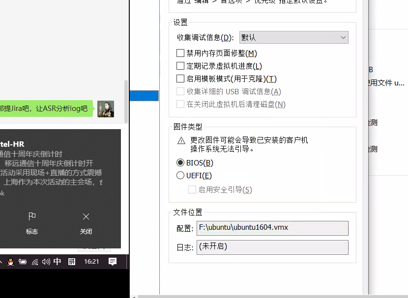

主控驱动
======


驱动不匹配
-----

根据USB协议，驱动匹配对应的设备，取决于USB设备的描述符信息。

有时候，你会遇到

	缺少USB或者ttyUSB;
	驱动对应关系不对;
	adb功能无法打开等；

譬如正常情况，对RG81，
 


但是客户看到的现象是


这种情况需要调整option.c


    option_probe(
        ...
    if ((idProduct&0xF000) == 0x8000) {
                //HISI interface 0 is NCM
                if (bInterfaceNumber == 0)
                    return -ENODEV;
            }
        ...

原始情况

	bInterfaceNumber == 0 

修改成

	bInterfaceNumber == 0 | bInterfaceNumber == 1

This is due to a change in the current RG80x USB interface descriptor functionality.There will be fully available network card drivers that can be compiled directly. Please contact Quectel FAE if you encounter this problem.

    option_probe(
        ...
    if ((idProduct&0xF000) == 0x8000) {
                //HISI interface 0 is NCM
                if ( (0 == bInterfaceNumber) || (1 == bInterfaceNumber)  )
                    return -ENODEV;
            }
        ...


You might see all all the Interfaces have been matched with option or qmi_wwan_q.


	lsusb -v

 

	cat /sys/kernel/debug/usb/devices

 

The interface should be matched with option, but it is matched with qmi_wwan_q.

I told him to build the kernel driver as kernel modules rather than builded in kernel.

Then try install option driver first, and install qmi_wwan_q later.

And then the problem was solved.

BTW, actully it is kernel 3.4, if he used GobiNet, no such problem would happen.


For ASR modules, such as EC200S, the interface 0 and 1 should match net driver such cdc_ether, and the interface 2 to 4 should match option. 


USB
======

hub port 和sysfs
------

https://www.lynxbee.com/understanding-sysfs-and-usb/

```
$ cd /sys/bus/usb/devices 

/sys/bus/usb/devices# ls -al usb*
usb1 -> ../../../devices/pci0000:00/0000:00:1d.7/usb1
usb2 -> ../../../devices/pci0000:00/0000:00:1d.0/usb2
usb3 -> ../../../devices/pci0000:00/0000:00:1d.1/usb3
usb4 -> ../../../devices/pci0000:00/0000:00:1d.2/usb4
usb5 -> ../../../devices/pci0000:00/0000:00:1d.3/usb5
```
correlate it with lsusb. A simple shell script which will print only RootHubs available on your machine.

```
#!/bin/sh
TOTAL_BUS_NUM=$1
for (( i=1; i <= $TOTAL_BUS_NUM; i++ ))
do
    lsusb -s $i:1
done
```
On Ubuntu ,the lsusb cmd:
```
Usage: lsusb [options]...
List USB devices
  -v, --verbose
      Increase verbosity (show descriptors)
  -s [[bus]:][devnum]
      Show only devices with specified device and/or
      bus numbers (in decimal)
  -d vendor:[product]
      Show only devices with the specified vendor and
      product ID numbers (in hexadecimal)
  -D device
      Selects which device lsusb will examine
  -t, --tree
      Dump the physical USB device hierarchy as a tree

```

	v@v:~$ ls /sys/bus/usb/drivers/usb | grep -E '^[1-9]-[1-9](.[1-9])?'

	1-1
	1-2

固定了BUS Num和Hub Port Num后，这两个值也不会变。


供电问题
-------

**no configuration chosen from 1 choice**

[RK3339 USB：no configuration chosen from 1 choice](https://blog.csdn.net/kris_fei/article/details/84065481)

现象

	usb 1-1.1: rejected 1 configuration due to insufficient available bus power
	usb 1-1.1: no configuration chosen from 1 choice

临时修改
	
	echo 1 > /sys/bus/usb/devices/2-1.2/bConfigurationValue
	
usb驱动对电流的计算在hub_configure()以及hub_power_remaining()中。

	diff --git a/drivers/usb/core/hub.c b/drivers/usb/core/hub.c
	index fb9223c..50e38b3 100644
	--- a/drivers/usb/core/hub.c
	+++ b/drivers/usb/core/hub.c
	@@ -1482,8 +1482,19 @@ static int hub_configure(struct usb_hub *hub,
				hub->limited_power = 1;
			}
		} else if ((hubstatus & (1 << USB_DEVICE_SELF_POWERED)) == 0) {
	+
	+#if 1
	+               int remaining;
	+               full_load = 2000;
	+               hdev->bus_mA = full_load;
	+               unit_load  = 500;
	+               hub->descriptor->bHubContrCurrent = unit_load;
	+               remaining = hdev->bus_mA -
	+                       hub->descriptor->bHubContrCurrent;
	+#else
			int remaining = hdev->bus_mA -
				hub->descriptor->bHubContrCurrent;
	+#endif
	 
			dev_dbg(hub_dev, "hub controller current requirement: %dmA\n",
				hub->descriptor->bHubContrCurrent);


kevent * may have been dropped
------


Every once in a while when my system is under a bit of stress I see
some spammy messages show up in my logs that say:

  kevent X may have been dropped

As far as I can tell these messages aren't terribly useful.  The
comments around the messages make me think that either workqueues used
to work differently or that the original author of the code missed a
sublety related to them.  The error message appears to predate the git
conversion of the kernel so it's somewhat hard to tell.

Specifically, workqueues should work like this:

A) If a workqueue hasn't been scheduled then schedule_work() schedules
   it and returns true.

B) If a workqueue has been scheduled (but hasn't started) then
   schedule_work() will do nothing and return false.

C) If a workqueue has been scheduled (and has started) then
   schedule_work() will put it on the queue to run again and return
   true.

Said another way: if you call schedule_work() you can guarantee that
at least one full runthrough of the work will happen again.  That
should mean that the work will get processed and I don't see any
reason to think something should be dropped.

Reading the comments in in usbnet_defer_kevent() made me think that B)
and C) would be treated the same.  That is: even if we've started the
work and are 99% of the way through then schedule_work() would return
false and the work wouldn't be queued again.  If schedule_work()
really did behave that way then, truly, some amount of work would be
lost.  ...but it doesn't.

NOTE: if somehow these warnings are useful to mean something then
perhaps we should change them to make it more obvious.  If it's
interesting to know when the work is backlogged then we should change
the spam to say "warning: usbnet is backlogged".

ALSO NOTE: If somehow some of the types of work need to be repeated if
usbnet_defer_kevent() is called multiple times then that should be
quite easy to accomplish without dropping any work on the floor.  We
can just keep an atomic count for that type of work and add a loop
into usbnet_deferred_kevent().

	patch:

	diff --git a/drivers/net/usb/usbnet.c b/drivers/net/usb/usbnet.c
	index 6510e5cc1817..a3e8dbaadcf9 100644
	--- a/drivers/net/usb/usbnet.c
	+++ b/drivers/net/usb/usbnet.c
	@@ -450,19 +450,17 @@  static enum skb_state defer_bh(struct usbnet *dev, struct sk_buff *skb,
	 }
	 
	 /* some work can't be done in tasklets, so we use keventd
	- *
	- * NOTE:  annoying asymmetry:  if it's active, schedule_work() fails,
	- * but tasklet_schedule() doesn't.  hope the failure is rare.
	  */
	 void usbnet_defer_kevent (struct usbnet *dev, int work)
	 {
	 	set_bit (work, &dev->flags);
	-	if (!schedule_work (&dev->kevent)) {
	-		if (net_ratelimit())
	-			netdev_err(dev->net, "kevent %d may have been dropped\n", work);
	-	} else {
	-		netdev_dbg(dev->net, "kevent %d scheduled\n", work);
	-	}
	+
	+	/* If work is already started this will mark it to run again when it
	+	 * finishes; if we already had work pending and it hadn't started
	+	 * yet then that's fine too.
	+	 */
	+	schedule_work (&dev->kevent);
	+	netdev_dbg(dev->net, "kevent %d scheduled\n", work);
	 }
	 EXPORT_SYMBOL_GPL(usbnet_defer_kevent);


PM
----

模组的PowerManagement其实就是USB的PM。不包括降频、cpuidle、dvfs等LPM strategy.
移远模组和Host AP之间连接，PM问题包括两个大方便，USB 在system suspend时的行为和USB dynamic suspend行为。

----


实际上网卡工作在raw ip模式，MAC地址是没意义的。并且QMAP分出的多个网卡有相同的MAC。

客户出于产品目的，需要修改MAC地址或者固定IP地址。

客户可以使用命令

	ifconfig wwan0.1 hw ether xx:xx:xx:xx:xx:xx
	
如果需要开机固定，请命令添加到开机脚本中。

但是！！！
客户发现不能修改，报错。需要修改网卡驱动源码qmi_wwan_q.c

## QMAP 分出的多路网卡MAC地址随机

	
	+++ b/qmi_wwan_q.c
	@@ -1158,7 +1158,16 @@ static int qmap_register_device(sQmiWwanQmap * pDev, u8 offset_id)
	priv->mux_id = QUECTEL_QMAP_MUX_ID + offset_id;
	sprintf(qmap_net->name, "%s.%d", real_dev->name, offset_id + 1);
	qmap_net->netdev_ops = &qmap_netdev_ops;

	-memcpy (qmap_net->dev_addr, real_dev->dev_addr, ETH_ALEN);
	
	+ //memcpy (qmap_net->dev_addr, real_dev->dev_addr, ETH_ALEN);
	+ 
	+ eth_hw_addr_random(qmap_net);
	+ if (ether_addr_equal(qmap_net->dev_addr, default_modem_addr))
	+ eth_hw_addr_random(qmap_net);
	+
	+ /* make MAC addr easily distinguishable from an IP header */
	+ if (possibly_iphdr(qmap_net->dev_addr)) {
	+ qmap_net->dev_addr[0] |= 0x02; /* set local assignment bit */
	+ qmap_net->dev_addr[0] &= 0xbf; /* clear "IP" bit */
	+ }


## 支持手动修改

  ifconfig wwan0.1 hw ether xx:xx:xx:xx:xx:xx

if you failed, modify the qmi_wwan_q.c as follow

	+  static int qmi_wwan_mac_addr(struct net_device *dev, void *p);
	static const struct net_device_ops qmap_netdev_ops = {
	.ndo_open = qmap_open,
	.ndo_stop = qmap_stop,
	.ndo_start_xmit = qmap_start_xmit,
	+  .ndo_set_mac_address = qmi_wwan_mac_addr,
	+  .ndo_validate_addr = eth_validate_addr,
	};

对5G模组，以下两个结构体也要加上

	+  .ndo_set_mac_address = qmi_wwan_mac_addr,
	+  .ndo_validate_addr = eth_validate_addr,

qmi_wwan_q.c
	
	static const struct net_device_ops qmap_netdev_ops = {
		.ndo_open       = qmap_open,
		.ndo_stop       = qmap_stop,
		.ndo_start_xmit = qmap_start_xmit,
	};

	static const struct net_device_ops rmnet_vnd_ops = {
		.ndo_open       = qmap_open,
		.ndo_stop       = qmap_stop,
		.ndo_start_xmit = rmnet_vnd_start_xmit,
		.ndo_change_mtu = rmnet_vnd_change_mtu,
	#if defined(MHI_NETDEV_STATUS64)
		.ndo_get_stats64	= rmnet_vnd_get_stats64,
	#endif
	};

	

编译报错
---

To the superior this section customer ignores, suggests the customer to check the compilation error by itself

Ubuntu 

All the tools and driver source code Quectel releases have been verified on mainstream Liunx systems, from kernel 2.6 to the latest kernel versions, but there are cases where the customer has encountered problems during compilation.


### SecureBoot

	modprobe: unsigned module loading is restricted; see man kernel_lockdown.7

rootcause:
	
[SecureBoot](https://unix.stackexchange.com/questions/543576/modprobe-fails-with-operation-not-permitted)





### 


### Stdarg.h

You might meet this: 


Add this into Makefile:
	ccflags-y = -Wno-declaration-after-statement -mpopcnt -I/usr/lib/gcc/x86_64-linux-gnu/5.4.0/include


### quectel-CM sa_family_t
编译遇到报错

	v@v-VirtualBox:~/Smart210/Quectel/quectel-CM$ make
	rm -rf quectel-CM *~
	rm -rf quectel-qmi-proxy
	arm-linux-gcc -Wall -s quectel-qmi-proxy.c  -o quectel-qmi-proxy -lpthread -ldl
	arm-linux-gcc -Wall -s quectel-mbim-proxy.c  -o quectel-mbim-proxy -lpthread -ldl
	In file included from quectel-mbim-proxy.c:1:0:
	/home/v/Smart210/opt/FriendlyARM/toolschain/4.5.1/bin/../lib/gcc/arm-none-linux-gnueabi/4.5.1/../../../../arm-none-linux-gnueabi/include/linux/un.h:7:2: error: expected specifier-qualifier-list before 'sa_family_t'
	quectel-mbim-proxy.c: In function 'proxy_make_server':
	quectel-mbim-proxy.c:130:13: error: 'struct sockaddr_un' has no member named 'sun_family'
	quectel-mbim-proxy.c:131:13: error: 'struct sockaddr_un' has no member named 'sun_path'
	quectel-mbim-proxy.c:132:22: error: 'struct sockaddr_un' has no member named 'sun_path'
	quectel-mbim-proxy.c:139:32: error: 'struct sockaddr_un' has no member named 'sun_path'
	make: *** [mbim-proxy] Error 1

gcc （包括cross_compile）版本低(小于4.6)有这个问题。

在没办法升级cross_compile tool 的情况下，可以考虑降quectel-CM版本，或者修改quectel-CM源码。对大多数情况，mbim-proxy用不到。


