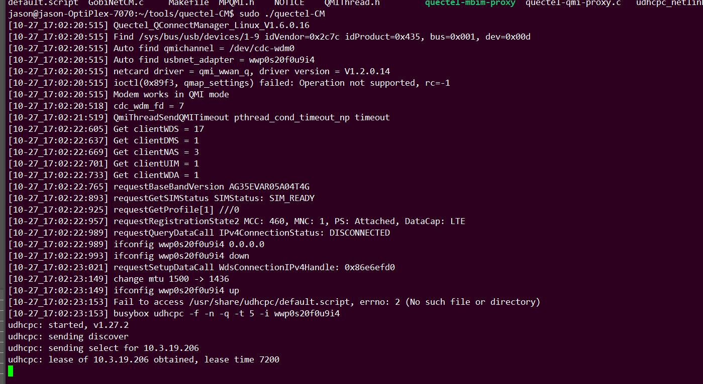

quectel-CM
=========


Quectel Connect Manager 又称quectel-CM，下文简称CM。
下文中Quectel Connect Manager、quectel-CM和CM指向相同。
5G模组（RM500Q和RG500Q）使用的CM版本使用最新版本(1.6.0.16)，对4G模组（EC2X）建议也使用最新版本的CM工具。


``` sequence
title: the QMI between modules and the Host AP
participant HostAP
participant QuectelModules

HostAP -> QuectelModules: QMICTL_SYNC_REQ
QuectelModules->HostAP: QMICTL_SYNC_RESP
HostAP->QuectelModule : ...
QuectelModules->HostAP: ...
HostAP->QuectelModules: QMIWDS_GET_PKT_SRVC_STATUS_REQ
QuectelModules->HostAP: QMIWDS_GET_PKT_SRVC_STATUS _RESP
```

detailed please refer to 
[kba-20190602_guide_to_use_qmap](https://knowledge.quectel.com/display/FAEinternalsharing/01-2020.02.11-driver-kba-20190602_guide_to_use_qmap)

This doc can be accessed by the Quectel.

prerequisites
-----------

- 注网状态检查
<br>
确认模组注册上4G或者5G网络。用AT指令检查

/[]AT+COPS?
[]AT+QENG=servingcell

- dhcp客户端程序
<br>
PC或者服务器系统上自带dhclient，
嵌入式平台上使用udhcpc，busybox工具之一。

- 网卡驱动
<br>
CM用于RMNET网卡（AT+QCFG=usbnet，0），对应驱动qmi_wwan_q或者GobiNet；
以及MBIM网卡（AT+QCFG=usbnet，2），对应驱动cdc_mbim。

Build and Copy to Target Platform
-----

如果在当前系统上使用直接make即可，对嵌入式平台，将源码交叉编译。最终生成目标文件

- **quectel-CM**: 目标可执行文件
- **qmi-proxy** 和 **mbim-proxy** : 代理工具，用于多路拨号。如果不需要多路拨号，不用理会。

注意事项:<br>
	Gcc 版本较低（低于4.6），CFLAGS添加-lrt。

将编译得到的这三个目标文件拷贝到目标平台，如果是嵌入式平台，将quectel-CM源码里的default.script 也拷贝到目标平台。

注意事项:<br>
	
	default.script 是udhcpc 调用到的重要脚本。
	default脚本中不能存在不可见字符，譬如在DOS系统（Win10）打开过，每行结尾会是\r\n，会导致Unix系统中无法正常执行
	在目标平台上执行dos2unix default.script
	其中dos2unix 是一个将DOS系统字符转换称Unix系统字符的小工具。
	也可以用vim打开default.script, 手动将default.script每行结尾的^M删除。
	default.script 有执行权限。chmod +x default.script.
	default.script 的默认位置，一般是/etc/udhcpc/或者/usr/share/udhcpc/
	CM拨号默认使用的是busybox udhcpc （详情见CM源码目录中udhcpc.c）。对嵌入式系统，udhcpc 在编译busybox或buildroot的时候需要勾选，否则需要额外移植。	
	如使用Dhclient需要打开。#define USE_DHCLIENT。


Run CM 
-----

CM支持多路拨号、保存log、多模组、指定APN信息等各类要求的拨号。
	

	root@m:/home/m/quectel-CM# ./quectel-CM --help
	Quectel_QConnectManager_Linux_V1.6.0.16
	Usage: ./quectel-CM [options]
	-s [apn [user password auth]]                                          Set apn/user/password/auth
	-p pincode                                                 Verify sim card pin if sim card is locked
	-f logfilename                                             Save log message of this program to file
	-u usbmonlog filename                                     Save usbmon log of this program to file
	-i interface                                           Specify network interface(default auto-detect)
	-4                                                                               IPv4 protocol
	-6                                                                               IPv6 protocol
	-m muxID                                       Specify muxid when set multi-pdn data connection.
	-n channelID                       Specify channelID when set multi-pdn data connection(default 1).
	-k channelID                              Send SIGINT to quectel-CM which multi-pdn is channelID.
	-r                                             Detach and attach kernel driver before open device.
	-b                                              enable network interface bridge function(default 0).
	[Examples]
	Example 1: ./quectel-CM
	Example 2: ./quectel-CM -s 3gnet
	Example 3: ./quectel-CM -s 3gnet carl 1234 0 -p 1234 -f gobinet_log.txt

以下的实例DHCP客户端为busybox udhcpc。

### QMI Driver

通过AT指令将模组的USB网卡类型配置成MBIM
	
	AT+QCFG=usbnet，0
	
重启模组后，确认


	root@m:/home/m/quectel-CM# lsusb -t
	/:  Bus 02.Port 1: Dev 1, Class=root_hub, Driver=xhci_hcd/4p, 5000M
	/:  Bus 01.Port 1: Dev 1, Class=root_hub, Driver=xhci_hcd/11p, 480M
	    |__ Port 4: Dev 12, If 3, Class=Vendor Specific Class, Driver=option, 480M
	    |__ Port 4: Dev 12, If 1, Class=Vendor Specific Class, Driver=option, 480M
	    |__ Port 4: Dev 12, If 4, Class=Vendor Specific Class, Driver=qmi_wwan_q, 480M
	    |__ Port 4: Dev 12, If 2, Class=Vendor Specific Class, Driver=option, 480M
	|__ Port 4: Dev 12, If 0, Class=Vendor Specific Class, Driver=option, 480M
	
运行quectel-CM 开始拨号

	[11-30_17:26:14:656] Quectel_QConnectManager_Linux_V1.6.0.16
	[qmidevice_detect]/sys/bus/usb/devices/1-4/idProduct
	[11-30_17:26:14:657] Find /sys/bus/usb/devices/1-4 idVendor=0x2c7c idProduct=0x125, bus=0x001, dev=0x00d
	[11-30_17:26:14:657] Auto find qmichannel = /dev/cdc-wdm0
	[11-30_17:26:14:657] Auto find usbnet_adapter = wwan0
	[11-30_17:26:14:657] netcard driver = qmi_wwan_q, driver version = V1.2.0.14
	[11-30_17:26:14:657] ioctl(0x89f3, qmap_settings) failed: Operation not supported, rc=-1
	[11-30_17:26:14:658] qmap_mode = 1, qmap_version = 5, qmap_size = 4096, muxid = 0x81, qmap_netcard = wwan0
	[11-30_17:26:14:658] Modem works in QMI mode
	[11-30_17:26:14:669] cdc_wdm_fd = 7
	[11-30_17:26:15:670] QmiThreadSendQMITimeout pthread_cond_timeout_np timeout
	[11-30_17:26:16:755] Get clientWDS = 18
	[11-30_17:26:16:787] Get clientDMS = 1
	[11-30_17:26:16:819] Get clientNAS = 3
	[11-30_17:26:16:852] Get clientUIM = 1
	[11-30_17:26:16:883] Get clientWDA = 1
	[11-30_17:26:16:915] requestBaseBandVersion EC20CEHCLGR06A03M1G
	[11-30_17:26:16:947] qmap_settings.rx_urb_size = 4096
	[11-30_17:26:16:947] qmap_settings.ul_data_aggregation_max_datagrams  = 11
	[11-30_17:26:16:947] qmap_settings.ul_data_aggregation_max_size       = 4096
	[11-30_17:26:16:947] qmap_settings.dl_minimum_padding                 = 16
	[11-30_17:26:17:075] requestGetSIMStatus SIMStatus: SIM_READY
	[11-30_17:26:17:107] requestGetProfile[1] cmnet///0
	[11-30_17:26:17:139] requestRegistrationState2 MCC: 460, MNC: 0, PS: Attached, DataCap: LTE
	[11-30_17:26:17:172] requestQueryDataCall IPv4ConnectionStatus: DISCONNECTED
	[11-30_17:26:17:172] ifconfig wwan0 0.0.0.0
	[11-30_17:26:17:178] ifconfig wwan0 down
	[11-30_17:26:17:234] requestSetupDataCall WdsConnectionIPv4Handle: 0xe17f2560
	[11-30_17:26:17:364] ifconfig wwan0 up
	[11-30_17:26:17:369] busybox udhcpc -f -n -q -t 5 -i wwan0
	udhcpc: started, v1.30.1
	udhcpc: sending discover
	udhcpc: sending select for 10.199.162.152
	udhcpc: lease of 10.199.162.152 obtained, lease time 7200
	[11-30_17:26:17:504] /etc/udhcpc/default.script: Resetting default routes
	SIOCDELRT: 没有那个进程
	[11-30_17:26:17:509] /etc/udhcpc/default.script: Adding DNS 211.138.180.2
	[11-30_17:26:17:509] /etc/udhcpc/default.script: Adding DNS 211.138.180.3

### GobiNet

确认驱动

	root@m:/home/m/quectel-CM# lsusb -t
	/:  Bus 02.Port 1: Dev 1, Class=root_hub, Driver=xhci_hcd/4p, 5000M
	/:  Bus 01.Port 1: Dev 1, Class=root_hub, Driver=xhci_hcd/11p, 480M
	    |__ Port 4: Dev 12, If 3, Class=Vendor Specific Class, Driver=option, 480M
	    |__ Port 4: Dev 12, If 1, Class=Vendor Specific Class, Driver=option, 480M
	    |__ Port 4: Dev 12, If 4, Class=Vendor Specific Class, Driver=GobiNet, 480M
	    |__ Port 4: Dev 12, If 2, Class=Vendor Specific Class, Driver=option, 480M
	|__ Port 4: Dev 12, If 0, Class=Vendor Specific Class, Driver=option, 480M

运行CM

	[11-30_17:31:09:638] Quectel_QConnectManager_Linux_V1.6.0.16
	[qmidevice_detect]/sys/bus/usb/devices/1-4/idProduct
	[11-30_17:31:09:639] Find /sys/bus/usb/devices/1-4 idVendor=0x2c7c idProduct=0x125, bus=0x001, dev=0x00e
	[11-30_17:31:09:639] Auto find qmichannel = /dev/qcqmi0
	[11-30_17:31:09:639] Auto find usbnet_adapter = usb0
	[11-30_17:31:09:639] netcard driver = GobiNet, driver version = V1.6.2.9
	[11-30_17:31:10:067] qmap_mode = 1, qmap_version = 5, qmap_size = 4096, muxid = 0x81, qmap_netcard = usb0
	[11-30_17:31:10:067] Modem works in QMI mode
	[11-30_17:31:10:099] Get clientWDS = 7
	[11-30_17:31:10:131] Get clientDMS = 8
	[11-30_17:31:10:163] Get clientNAS = 9
	[11-30_17:31:10:195] Get clientUIM = 10
	[11-30_17:31:10:227] requestBaseBandVersion EC20CEHCLGR06A03M1G
	[11-30_17:31:10:355] requestGetSIMStatus SIMStatus: SIM_READY
	[11-30_17:31:10:387] requestGetProfile[1] cmnet///0
	[11-30_17:31:10:419] requestRegistrationState2 MCC: 460, MNC: 0, PS: Attached, DataCap: LTE
	[11-30_17:31:10:450] requestQueryDataCall IPv4ConnectionStatus: DISCONNECTED
	[11-30_17:31:10:450] ifconfig usb0 0.0.0.0
	[11-30_17:31:10:455] ifconfig usb0 down
	[11-30_17:31:10:515] requestSetupDataCall WdsConnectionIPv4Handle: 0xe17f16c0
	[11-30_17:31:10:643] ifconfig usb0 up
	[11-30_17:31:10:650] busybox udhcpc -f -n -q -t 5 -i usb0
	udhcpc: started, v1.30.1
	udhcpc: sending discover
	udhcpc: sending select for 10.211.128.177
	udhcpc: lease of 10.211.128.177 obtained, lease time 7200
	[11-30_17:31:10:799] /etc/udhcpc/default.script: Resetting default routes
	SIOCDELRT: 没有那个进程
	[11-30_17:31:10:807] /etc/udhcpc/default.script: Adding DNS 211.138.180.2
	[11-30_17:31:10:807] /etc/udhcpc/default.script: Adding DNS 211.138.180.3


### MBIM

通过AT指令将模组的USB网卡类型配置成MBIM

	AT+QCFG=usbnet，2

重启模组后，确认

	/:  Bus 01.Port 1: Dev 1, Class=root_hub, Driver=xhci_hcd/11p, 480M
	    |__ Port 4: Dev 11, If 3, Class=Vendor Specific Class, Driver=option, 480M
	    |__ Port 4: Dev 11, If 1, Class=Vendor Specific Class, Driver=option, 480M
	    |__ Port 4: Dev 11, If 4, Class=Communications, Driver=cdc_mbim, 480M
	    |__ Port 4: Dev 11, If 2, Class=Vendor Specific Class, Driver=option, 480M
	    |__ Port 4: Dev 11, If 0, Class=Vendor Specific Class, Driver=option, 480M
	|__ Port 4: Dev 11, If 5, Class=CDC Data, Driver=cdc_mbim, 480M

执行quectel-CM

	[11-30_16:56:42:350] Quectel_QConnectManager_Linux_V1.6.0.16
	[qmidevice_detect]/sys/bus/usb/devices/1-4/idProduct
	[11-30_16:56:42:351] Find /sys/bus/usb/devices/1-4 idVendor=0x2c7c idProduct=0x125, bus=0x001, dev=0x00b
	[11-30_16:56:42:352] Auto find qmichannel = /dev/cdc-wdm0
	[11-30_16:56:42:352] Auto find usbnet_adapter = wwan0
	[11-30_16:56:42:352] netcard driver = cdc_mbim, driver version = 22-Aug-2005
	[11-30_16:56:42:352] ioctl(0x89f3, qmap_settings) failed: Operation not supported, rc=-1
	[11-30_16:56:42:352] Modem works in MBIM mode
	[11-30_16:56:42:352] apn (null), user (null), passwd (null), auth 0
	[11-30_16:56:42:352] IP Proto MBIMContextIPTypeIPv4
	[11-30_16:56:42:352] mbim_read_thread is created
	sh: /sys/class/net/wwan0/mbim/link_state: 没有那个文件或目录
	[11-30_16:56:42:356] system(echo 0 > /sys/class/net/wwan0/mbim/link_state)=256
	[11-30_16:56:42:361] system(ip address flush dev wwan0)=0
	[11-30_16:56:42:365] system(ip link set dev wwan0 down)=0
	[11-30_16:56:42:365] mbim_open_device()
	[11-30_16:56:42:552] mbim_device_caps_query()
	[11-30_16:56:42:584] DeviceId:     867394041355693
	[11-30_16:56:42:584] FirmwareInfo: EC20CEHCLGR06A03M1G
	[11-30_16:56:42:584] HardwareInfo: QUECTEL Mobile Broadband Modul
	[11-30_16:56:42:584] mbim_device_services_query()
	[11-30_16:56:42:616] mbim_set_radio_state( 1 )
	[11-30_16:56:42:647] HwRadioState: 1, SwRadioState: 1
	[11-30_16:56:42:647] mbim_subscriber_status_query()
	[11-30_16:56:42:712] SubscriberReadyState NotInitialized -> Initialized
	[11-30_16:56:42:712] mbim_register_state_query()
	[11-30_16:56:42:744] RegisterState Unknown -> Home
	[11-30_16:56:42:744] mbim_packet_service_query()
	[11-30_16:56:42:776] PacketServiceState Unknown -> Attached
	[11-30_16:56:42:776] mbim_query_connect(sessionID=0)
	[11-30_16:56:42:808] ActivationState Unknown -> Deactivated
	[11-30_16:56:42:808] mbim_set_connect(onoff=1, sessionID=0)
	[11-30_16:56:42:872] ActivationState Deactivated -> Activated
	[11-30_16:56:42:872] mbim_ip_config(sessionID=0)
	[11-30_16:56:42:904] < SessionId = 0
	[11-30_16:56:42:904] < IPv4ConfigurationAvailable = 0xf
	[11-30_16:56:42:904] < IPv6ConfigurationAvailable = 0x0
	[11-30_16:56:42:904] < IPv4AddressCount = 0x1
	[11-30_16:56:42:904] < IPv4AddressOffset = 0x3c
	[11-30_16:56:42:904] < IPv6AddressCount = 0x0
	[11-30_16:56:42:904] < IPv6AddressOffset = 0x0
	[11-30_16:56:42:904] < IPv4 = 10.140.255.29/30
	[11-30_16:56:42:904] < gw = 10.140.255.30
	[11-30_16:56:42:904] < dns1 = 211.138.180.2
	[11-30_16:56:42:904] < dns2 = 211.138.180.3
	[11-30_16:56:42:904] < ipv4 mtu = 1500
	sh: /sys/class/net/wwan0/mbim/link_state: 没有那个文件或目录
	[11-30_16:56:42:908] system(echo 1 > /sys/class/net/wwan0/mbim/link_state)=256
	[11-30_16:56:42:914] system(ip link set dev wwan0 up)=0
	[11-30_16:56:42:918] system(ip -4 address flush dev wwan0)=0
	[11-30_16:56:42:922] system(ip -4 address add 10.140.255.29/30 dev wwan0)=0
	[11-30_16:56:42:926] system(ip -4 route add default via 10.140.255.30 dev wwan0)=0
	[11-30_16:56:42:929] system(ip -4 link set dev wwan0 mtu 1500)=0

udhcpc
------

	
	RESOLV_CONF="/etc/resolv.conf"

	case $1 in
	    bound|renew)
		[ -n "$broadcast" ] && BROADCAST="broadcast $broadcast"
		[ -n "$subnet" ] && NETMASK="netmask $subnet"

		/sbin/ifconfig $interface $ip $BROADCAST $NETMASK

		if [ -n "$router" ]; then
		    echo "$0: Resetting default routes"
		    while /sbin/route del default gw 0.0.0.0 dev $interface; do :; done

		    metric=0
		    for i in $router; do
			/sbin/route add default gw $i dev $interface metric $metric
			metric=$(($metric + 1))
		    done
		fi

		# Update resolver configuration file
		R=""
		[ -n "$domain" ] && R="domain $domain"
		for i in $dns; do
		    echo "$0: Adding DNS $i"
		    R="${R}nameserver $i"
		done

		if [ -x /sbin/resolvconf ]; then
		    echo -n "$R" | resolvconf -a "${interface}.udhcpc"
		else
		    echo -n "$R" > "$RESOLV_CONF"
		fi
		;;

	    deconfig)
		if [ -x /sbin/resolvconf ]; then
		    resolvconf -d "${interface}.udhcpc"
		fi
		/sbin/ifconfig $interface 0.0.0.0
		;;

	    leasefail)
		echo "$0: Lease failed: $message"
		;;

	    nak)
		echo "$0: Received a NAK: $message"
		;;

	    *)
		echo "$0: Unknown udhcpc command: $1";
		exit 1;
		;;
	esac


### COMMON Issue

You will see log as follow:



There will be no more log later.

There are some things you should check:

	1.modemmanager

	2.There is a valid default.script for udhcpc
		- It is /etc/udhcpc/default.script but not /usr/share/udhcpc/default.script
		- The default.script has invisble characters. dos2unix default.script
		- No execution permission. chmod +w default.script
 
	3.On Ubuntu/Centos PC, it's recommended and easier to use dhclient.
