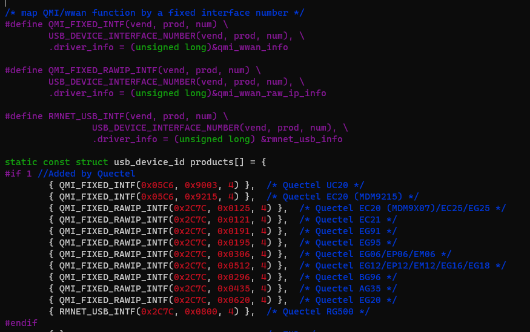

----------

Net Interface Type can be configured with AT cmds. 

AT+QCFG="usbnet"

<!-- Row Highlight Javascript -->

<table id="tfhover" class="tftable" border="1">

<tr><th>Net Interface Type</th><th>LinuDriver</th><th>Dialup Way</th><th>Physical</th></tr>
<tr><td>rmnet/qmi/ndis  
 at+qcfg="usbnet",0
</td><td>qmi_wwan&cdc_wdm
CONFIG_USB_NET_QMI_WWAN  
KernelVersion >= 3.4 | 
GobiNet

</td><td>libqmi(Ubuntu)
uqmi(openWRT) 
quectel-CM(推荐方式) 
AT$QCRMCALL=1,1
</td><td>IP Frame</td></tr>
<tr><td>ECM
a+qcfg="usbnet",1  
automotive OpenLinux
</td><td>CONFIG_USB_NET_CDCETHER</td><td>autoconnect</td><td>Ethernet Frame</td></tr>
<tr><td>mbim  
at+qcfg="usbnet",2  
Win10 Notebooks,EM/E Serials
</td><td>CONFIG_USB_NET_CDC_MBIM  
KernelVersion >= 3.9
</td><td>mbim protocol
libmbim(Ubuntu)
quectel-CM</td><td>MBIM Frame</td></tr>
<tr><td>rndis 
at+qcfg="usbnet",3
</td><td>CONFIG_USB_NET_RNDIS_HOST</td><td>autoconnect</td><td>Ethernet Frame</td></tr>
</table>

Other Net type such as NCM/ACM interface works much same with ECM/RNDIS.

其他网络接口譬如NCM和ECM、RNDIS差不多。

obj-$(CONFIG_USB_NET_CDC_NCM)	+= cdc_ncm.o

----------

# RMNET #
### QMI ###

There exsits qmi driver in the Linux Kernel from version 3.4.

[qmi_wwan.c](https://elixir.bootlin.com/linux/v4.14.181/source/drivers/net/usb/qmi_wwan.c)

It can be used on Quectel LTE modules.
However, Quectel IP Multiplexing and IP Aggregation is not supported on that driver. 

QMI will match interface 4 with itself.

### GobiNet ###

GobiNet 和 qmi_wwan(qmi_wwan_q) 之间二选一即可。GobiNet驱动在驱动加载的时候就会拉DTR。

If you want to dial with the AT instruction, you need to set the qcrmcall_mode in the driver to 1.

如果需要用AT指令拨号，修改GobiNet源码里的 qcrmcall_mode 为1 .

AT 指令拨号不支持 QMAP。如果驱动开启QMAP功能，模组则无法使用AT指令拨号。 

<table><tr><td bgcolor=yellow> Please  ask Quectel for the latest QMI and GobiNet drivers. </td></tr></table>

Mailto: support@quectel.com

#### QMAP ####

QMAPs full name is QUALCOMM Multiplexing and Aggregation Protocol. 

QMAP 全程是 Qualcomm 聚合和复用协议。

When using GobiNet or QMI_WWAN, only one Physical Network Card can be created by default, so only one PDN data call 
can be set up. However, multiple virtual Network Cards can be created by using IP multiplexing protocol over one Physical 
Network card, and customers can setup multiple PDN data calls. 
 
When using GobiNet or QMI_WWAN, only one IP Packet in one URB can be transferred, so when there are high throughput 
and frequent URB interrupts, the Host CPU will become overloaded. However, IP aggregation protocol can be used to transfer 
multiple IP Packets in one URB with increased throughput by reducing the number of URB interrupts. 
 
When QMAP disabled, GobiNet or QMI_WWAN directly transfer IP Packet over USB BUS. 
When QMAP enabled, GobiNet or QMI_WWAN transfer QMAP Packet over USB BUS. 

Kernel Doc description:
[QMAP](https://www.kernel.org/doc/html/v5.8/networking/device_drivers/qualcomm/rmnet.html)
 

EC21/EC25/EG06/EP06/EM06/EG12/EP12/EM12/EG16/EG18/EM20/RG500 all support QMAP. 

Ex06/Ex12/EM20/Rx500Q will force to use QMAP. 

	[244838.067277] usbcore: registered new interface driver qmi_wwan_q 
	[244844.970420] usb 2-1.2: new high-speed USB device number 22 using sunxi-ehci 
	[244845.090167] usb 2-1.2: New USB device found, idVendor=2c7c, idProduct=0435 
	[244845.090193] usb 2-1.2: New USB device strings: Mfr=1, Product=2, SerialNumber=0 
	[244845.090212] usb 2-1.2: Product: LTE Module 
	[244845.090229] usb 2-1.2: Manufacturer: Quectel, Incorporated 
	[244845.129638] qmi_wwan_q 2-1.2:1.4: cdc-wdm0: USB WDM device 
	[244845.129666] qmi_wwan_q 2-1.2:1.4: Quectel modules work on RawIP mode 
	[244845.135800] qmi_wwan_q 2-1.2:1.4 wwan0: register 'qmi_wwan_q' at usb-sunxi-ehci-1.2, WWAN/QMI 
	device, 2e:75:af:df:48:50 
	[244845.140199] net wwan0: qmap_register_device wwan0.1 
	[244845.142132] net wwan0: qmap_register_device wwan0.2 
	[244845.143211] net wwan0: qmap_register_device wwan0.3 
	[244845.144309] net wwan0: qmap_register_device wwan0.4 
	[244845.144329] qmi_wwan_q 2-1.2:1.4: rx_urb_size = 4096 

GobiNet Works much the same way.
	/*
	Test QMAP on GobiNet or QMI WWAN 
    0 - no QMAP 
    1 - QMAP (Aggregation protocol) 
    X - QMAP (Multiplexing and Aggregation protocol) 
	*/ 
	static uint __read_mostly qmap_mode = 4; 
	module_param( qmap_mode, uint, S_IRUGO | S_IWUSR );

	usb0.1 for data call setup on PDN-1 
	usb0.2 for data call setup on PDN-2 
	usb0.3 for data call setup on PDN-3 
	usb0.4 for data call setup on PDN-4 

the dmesg log

	[247365.213865] GobiNet: Quectel_WCDMA&LTE_Linux&Android_GobiNet_Driver_V1.5.0 
	[247365.214209] usbcore: registered new interface driver GobiNet 
	[247369.390423] usb 2-1.2: new high-speed USB device number 25 using sunxi-ehci 
	[247369.510166] usb 2-1.2: New USB device found, idVendor=2c7c, idProduct=0435 
	[247369.510193] usb 2-1.2: New USB device strings: Mfr=1, Product=2, SerialNumber=0 
	[247369.510212] usb 2-1.2: Product: LTE Module 
	[247369.510229] usb 2-1.2: Manufacturer: Quectel, Incorporated 
	[247369.560313] GobiNet 2-1.2:1.4 usb0: register 'GobiNet' at usb-sunxi-ehci-1.2, GobiNet Ethernet Device, 
	2e:75:af:df:48:50 
	[247369.561690] creating qcqmi0 
	[247369.563154] GobiNet::qmap_register_device usb0.1 
	[247369.564861] GobiNet::qmap_register_device usb0.2 
	[247369.566014] GobiNet::qmap_register_device usb0.3 
	[247369.567818] GobiNet::qmap_register_device usb0.4 
	[247379.851678] GobiNet::QMIWDASetDataFormat qmap settings qmap_enabled=5, rx_size=4096, tx_size=4096

----------

## ECM #

CDC ECM driver 是ECM接口的通用的标准，不需要对kernel源码做任何修改。只需要配置Kernel

	CONFIG_USB_USBNET=y 
	CONFIG_NETDEVICES=y 
	CONFIG_USB_NET_CDCETHER=y

kernel\drivers\net\usb\Makefile

	obj-$(CONFIG_USB_NET_CDCETHER)	+= cdc_ether.o

ECM接口在Quectel的基于高通平台的所有标准模组上，特点是自动拨号，不需要任何工具和执行AT指令。如果是Host是一台Ubuntu PC，在网卡配置成ECM的情况下，可能不需要任何操作，Ubuntu PC直接就可以联网了。
 
如果一部分不能联网，可能需要的步骤是：

- udhcpc -i usbX
- 添加192.168.X.1 为gateway和DNS

当然，前提是模组必须能注网成功，模块本身可以联网（用debug口进去可以ping公网，或者AT+QPING可以正常返回。）

对基于ASR和海思平台的配置成ECM接口的模组，模组不会自动拨号，需要手动用AT指令拨号。

海思平台自己的AT指令 AT+NIDSDUP=1,1
 
Quectel的AT拨号执行AT+QNETDEVCTL=1,1,1

----------

## MBIM #

(Only supported after Kernel 3.18) Related configuration items of CDC MBIM driver:

	 
	CONFIG_USB_USBNET=y 
	CONFIG_NETDEVICES=y 
	CONFIG_USB_NET_CDC_MBIM=y

kernel\drivers\net\usb

Makefile

	obj-$(CONFIG_USB_NET_CDC_MBIM)	+= cdc_mbim.o

Kconfig

	config USB_NET_CDC_MBIM
		tristate "CDC MBIM support"
		depends on USB_USBNET
		select USB_WDM
		select USB_NET_CDC_NCM

lsusb -t

    |__ Port 4: Dev 15, If 3, Class=Vendor Specific Class, Driver=option, 480M
    |__ Port 4: Dev 15, If 1, Class=Vendor Specific Class, Driver=option, 480M
    |__ Port 4: Dev 15, If 8, Class=Audio, Driver=snd-usb-audio, 480M
    |__ Port 4: Dev 15, If 6, Class=Audio, Driver=snd-usb-audio, 480M
    |__ Port 4: Dev 15, If 4, Class=Communications, Driver=cdc_mbim, 480M
    |__ Port 4: Dev 15, If 2, Class=Vendor Specific Class, Driver=option, 480M
    |__ Port 4: Dev 15, If 0, Class=Vendor Specific Class, Driver=option, 480M
    |__ Port 4: Dev 15, If 7, Class=Audio, Driver=snd-usb-audio, 480M
    |__ Port 4: Dev 15, If 5, Class=CDC Data, Driver=cdc_mbim, 480M

----------

## RNDIS #

不推荐使用RNDIS的。

对高通模组，主要是EC2X模组的RNDIS网卡会默认使用usb接口描述符0和1，这和其他的接口默认使用接口4不同。这点在上一章USB Serial中有介绍。

对5G模组如RM500Q的RNDIS暂未测试通过。如有网络需求，建议用ECM替代。

##More about ECM/RNDIS

/etc/mobileap_cfg.xml LAN配置

		<MobileAPLanCfg>
			<EnableIPV4>1</EnableIPV4>
			<EnableIPV6>1</EnableIPV6>
			<GatewayURL>mobileap.qualcomm.com</GatewayURL>
			<WlanMode>AP</WlanMode>
			<WlanRestartDelay>1</WlanRestartDelay>
			<MobileAPSTABridgeEnable>0</MobileAPSTABridgeEnable>
			<HostAPDCfg>/etc/misc/wifi/hostapd.conf</HostAPDCfg>
                        <HostAPDEntropy>/data/entropy_file</HostAPDEntropy>
			<STAModeHostAPDCfg>/etc/misc/wifi/sta_mode_hostapd.conf</STAModeHostAPDCfg>
			<APIPAddr>192.168.225.1</APIPAddr>
			<SubNetMask>255.255.255.0</SubNetMask>
			<EnableDHCPServer>1</EnableDHCPServer>
			<DHCPCfg>
				<StartIP>192.168.225.20</StartIP>
				<EndIP>192.168.225.60</EndIP>
				<LeaseTime>43200</LeaseTime>
			</DHCPCfg>

