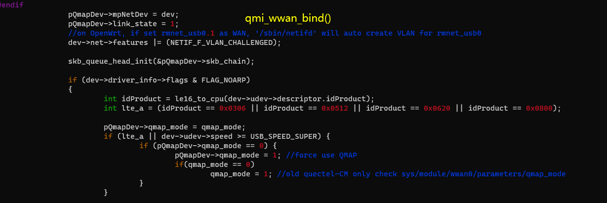

----------

Net Interface Type can be configured with AT cmds. 

AT+QCFG="usbnet"

<!-- Row Highlight Javascript -->

<table id="tfhover" class="tftable" border="1">

<tr><th>Net Interface Type</th><th>LinuDriver</th><th>Dialup Way</th><th>Physical</th></tr>
<tr><td>rmnet/qmi/ndis
at+qcfg="usbnet",0
</td><td>qmi_wwan&cdc_wdm
CONFIG_USB_NET_QMI_WWAN
KernelVersion >= 3.4 | 
GobiNet

</td><td>libqmi(Ubuntu)
uqmi(openWRT)
quectel-CM
AT$QCRMCALL=1,1
</td><td>IP Frame</td></tr>
<tr><td>ecm
a+qcfg="usbnet",1
automotive OpenLinux
</td><td>CONFIG_USB_NET_CDCETHER</td><td>autoconnect</td><td>Ethernet Frame</td></tr>
<tr><td>mbim
at+qcfg="usbnet",2
Win10 Notebooks,EM/E Serials
</td><td>CONFIG_USB_NET_CDC_MBIM
KernelVersion >= 3.9
</td><td>mbim protocol
libmbim(Ubuntu)
quectel-M</td><td>MBIM Frame</td></tr>
<tr><td>rndis
at+qcfg="usbnet",3
</td><td>CONFIG_USB_NET_RNDIS_HOST</td><td>autoconnect</td><td>Ethernet Frame</td></tr>
</table>

Other Net type such as NCM/ACM interface works much same with ECM/RNDIS.

obj-$(CONFIG_USB_NET_CDC_NCM)	+= cdc_ncm.o

----------

# RMNET #
### QMI ###

There exsits qmi driver in the Linux Kernel from version 3.4.

[qmi_wwan.c](https://elixir.bootlin.com/linux/v4.14.181/source/drivers/net/usb/qmi_wwan.c)

It can be used on Quectel LTE modules.
However, Quectel IP Multiplexing and IP Aggregation is not supported on that driver. 

QMI will match interface 4 with itself.

### GobiNet ###

If you want to dial with the AT instruction, you need to set the qcrmcall_mode in the driver to 1.

<table><tr><td bgcolor=yellow> Please  ask Quectel for the latest QMI and GobiNet drivers. </td></tr></table>

Mailto: support@quectel.com

#### QMAP ####

QMAPs full name is QUALCOMM Multiplexing and Aggregation Protocol. 

When using GobiNet or QMI_WWAN, only one Physical Network Card can be created by default, so only one PDN data call 
can be set up. However, multiple virtual Network Cards can be created by using IP multiplexing protocol over one Physical 
Network card, and customers can setup multiple PDN data calls. 
 
When using GobiNet or QMI_WWAN, only one IP Packet in one URB can be transferred, so when there are high throughput 
and frequent URB interrupts, the Host CPU will become overloaded. However, IP aggregation protocol can be used to transfer 
multiple IP Packets in one URB with increased throughput by reducing the number of URB interrupts. 
 
When QMAP disabled, GobiNet or QMI_WWAN directly transfer IP Packet over USB BUS. 
When QMAP enabled, GobiNet or QMI_WWAN transfer QMAP Packet over USB BUS. 
 
EC21/EC25/EG06/EP06/EM06/EG12/EP12/EM12/EG16/EG18/EM20/RG500 all support QMAP. 

Ex06/Ex12/EM20/Rx500Q will force to use QMAP. 

	[244838.067277] usbcore: registered new interface driver qmi_wwan_q 
	[244844.970420] usb 2-1.2: new high-speed USB device number 22 using sunxi-ehci 
	[244845.090167] usb 2-1.2: New USB device found, idVendor=2c7c, idProduct=0435 
	[244845.090193] usb 2-1.2: New USB device strings: Mfr=1, Product=2, SerialNumber=0 
	[244845.090212] usb 2-1.2: Product: LTE Module 
	[244845.090229] usb 2-1.2: Manufacturer: Quectel, Incorporated 
	[244845.129638] qmi_wwan_q 2-1.2:1.4: cdc-wdm0: USB WDM device 
	[244845.129666] qmi_wwan_q 2-1.2:1.4: Quectel modules work on RawIP mode 
	[244845.135800] qmi_wwan_q 2-1.2:1.4 wwan0: register 'qmi_wwan_q' at usb-sunxi-ehci-1.2, WWAN/QMI 
	device, 2e:75:af:df:48:50 
	[244845.140199] net wwan0: qmap_register_device wwan0.1 
	[244845.142132] net wwan0: qmap_register_device wwan0.2 
	[244845.143211] net wwan0: qmap_register_device wwan0.3 
	[244845.144309] net wwan0: qmap_register_device wwan0.4 
	[244845.144329] qmi_wwan_q 2-1.2:1.4: rx_urb_size = 4096 

GobiNet Works much the same way.
	/*
	Test QMAP on GobiNet or QMI WWAN 
    0 - no QMAP 
    1 - QMAP (Aggregation protocol) 
    X - QMAP (Multiplexing and Aggregation protocol) 
	*/ 
	static uint __read_mostly qmap_mode = 4; 
	module_param( qmap_mode, uint, S_IRUGO | S_IWUSR );

	usb0.1 for data call setup on PDN-1 
	usb0.2 for data call setup on PDN-2 
	usb0.3 for data call setup on PDN-3 
	usb0.4 for data call setup on PDN-4 

the dmesg log

	[247365.213865] GobiNet: Quectel_WCDMA&LTE_Linux&Android_GobiNet_Driver_V1.5.0 
	[247365.214209] usbcore: registered new interface driver GobiNet 
	[247369.390423] usb 2-1.2: new high-speed USB device number 25 using sunxi-ehci 
	[247369.510166] usb 2-1.2: New USB device found, idVendor=2c7c, idProduct=0435 
	[247369.510193] usb 2-1.2: New USB device strings: Mfr=1, Product=2, SerialNumber=0 
	[247369.510212] usb 2-1.2: Product: LTE Module 
	[247369.510229] usb 2-1.2: Manufacturer: Quectel, Incorporated 
	[247369.560313] GobiNet 2-1.2:1.4 usb0: register 'GobiNet' at usb-sunxi-ehci-1.2, GobiNet Ethernet Device, 
	2e:75:af:df:48:50 
	[247369.561690] creating qcqmi0 
	[247369.563154] GobiNet::qmap_register_device usb0.1 
	[247369.564861] GobiNet::qmap_register_device usb0.2 
	[247369.566014] GobiNet::qmap_register_device usb0.3 
	[247369.567818] GobiNet::qmap_register_device usb0.4 
	[247379.851678] GobiNet::QMIWDASetDataFormat qmap settings qmap_enabled=5, rx_size=4096, tx_size=4096

----------

## ECM #

CDC ECM driver is the ECM universal driver of module adaptation standard, no additional code modification, directly configure the compilation item.CDC ECM driver related configuration items:

	CONFIG_USB_USBNET=y 
	CONFIG_NETDEVICES=y 
	CONFIG_USB_NET_CDCETHER=y

kernel\drivers\net\usb\Makefile

	obj-$(CONFIG_USB_NET_CDCETHER)	+= cdc_ether.o

----------

## MBIM #

(Only supported after Kernel 3.18) Related configuration items of CDC MBIM driver:

	 
	CONFIG_USB_USBNET=y 
	CONFIG_NETDEVICES=y 
	CONFIG_USB_NET_CDC_MBIM=y

kernel\drivers\net\usb

Makefile

	obj-$(CONFIG_USB_NET_CDC_MBIM)	+= cdc_mbim.o

Kconfig

	config USB_NET_CDC_MBIM
		tristate "CDC MBIM support"
		depends on USB_USBNET
		select USB_WDM
		select USB_NET_CDC_NCM

----------

