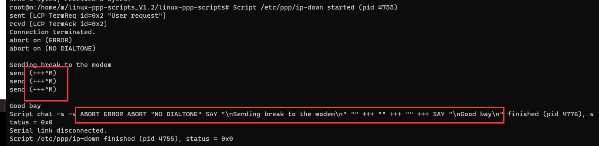

Actually it is not good idea to put ppp in this chapter.

ppp won't occupy an USB interface descriptor. 

ppp is one way the modules to set up data call on the data link layer. Normally the modules will use the USB interface 3 (you can call it ttyPPP port, or ttyModem port, it will be shown as a modem in the devmgmt on Windows OS.) to start a ppp connection.

Point - to - Point Protocol (PPP) is a communication protocol of the data link layer that is used to transmit multiprotocol data between two directly connected (point-to-point) computers. It is a byte - oriented protocol that is widely used in broadband communications having heavy loads and high speeds. Since it is a data link layer protocol, data is transmitted in frames. It is also known as RFC 1661.


``` Exit status values.

	#define EXIT_OK			0
	#define EXIT_FATAL_ERROR	1
	#define EXIT_OPTION_ERROR	2
	#define EXIT_NOT_ROOT		3
	#define EXIT_NO_KERNEL_SUPPORT	4
	#define EXIT_USER_REQUEST	5
	#define EXIT_LOCK_FAILED	6
	#define EXIT_OPEN_FAILED	7
	#define EXIT_CONNECT_FAILED	8
	#define EXIT_PTYCMD_FAILED	9
	#define EXIT_NEGOTIATION_FAILED	10
	#define EXIT_PEER_AUTH_FAILED	11
	#define EXIT_IDLE_TIMEOUT	12
	#define EXIT_CONNECT_TIME	13
	#define EXIT_CALLBACK		14
	#define EXIT_PEER_DEAD		15
	#define EXIT_HANGUP		16
	#define EXIT_LOOPBACK		17
	#define EXIT_INIT_FAILED	18
	#define EXIT_AUTH_TOPEER_FAILED	19
	#ifdef MAXOCTETS
	#define EXIT_TRAFFIC_LIMIT	20
	#endif
	#define	 EXIT_CNID_AUTH_FAILED	21
```

[pppd.h](http://androidos.net.cn/android/9.0.0_r8/xref/external/ppp/pppd/pppd.h)


### modem hangup

It's not easy to judge the reason of exit_Hangup.

Sometime it is bug of the module.

Quectel need the modem log to analyze the root cause.

There is a application scenarios we will catch the modem hangup.

The first time the ppp dial up OK. And once we shutdown the pppd process, we can not dial up again. We need to reset the module at that time.

I conclude those attention:

	1. Kill the prorcess by "killall pppd" works fine, but "kill -9 ${PID}" will not.

	2. killall will show 



	and you'll see the ppp end up normally.
	
	3.kill -9 ${PID} you can see nothing about how the pppd process ends up.


---

### the difference between SIGINT,SIGTERM,SIGHUP

to be done..

waiting ...

---

More about PPP protocol

[Point to Point Protocol(PPP) by vkota1.@sycamores.indstate.edu](http://cs.indstate.edu/~vkota1/main.pdf)

UCxx PPPÈóÆÈ¢òÂàùÊ≠•ÊéíÊü•ÊáÂغ_V01_Max_2015-09-23(1).docx
