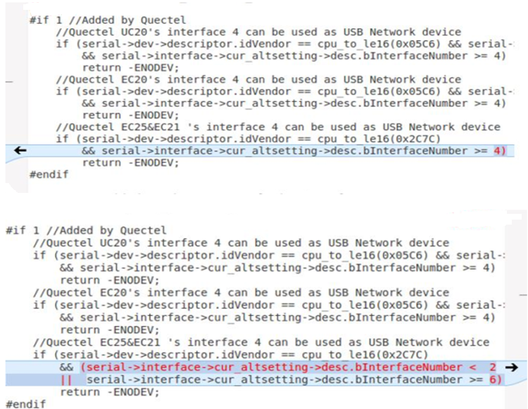

UsbSerial
======

USB 接口可以是tty设备。
Qualcomm模组，一般有以下端口

	DM Port (for diagnose, firmware upgrading);
	GPS Port (for nmea log output)
	AT Port (For AT cmd test)
	ppp Port (Also known as modem, can be used for AT cmd test too);

If there no any other ttyUSB device exists, you'll see device nodes created:
	/dev/ttyUSB0, /dev/ttyUSB1, dev/ttyUSB2, /dev/ttyUSB3 

Add PID and VID
-----

Add Quectel VID and PID into ${KERNELDIR}/driver/usb/serial/option.c
    
	static const struct usb_device_id option_ids[] = {   
	#if 1 //Added by Quectel
	{ USB_DEVICE(0x2C7C, 0x0125) }, /* Quectel EC20 R2.0/EC20 R2.1/EC25/EG25-G/EM05 */
	{ USB_DEVICE(0x2C7C, 0x0121) }, /* Quectel EC21/EG21-G */
	{ USB_DEVICE(0x2C7C, 0x0191) }, /* Quectel EG91 */
	{ USB_DEVICE(0x2C7C, 0x0195) }, /* Quectel EG95 */
	{ USB_DEVICE(0x2C7C, 0x0306) }, /* Quectel EG06/EP06/EM06 */
	{ USB_DEVICE(0x2C7C, 0x0512) }, /* Quectel EG12/EM12/EG18 */
	{ USB_DEVICE(0x2C7C, 0x0296) }, /* Quectel BG96 */
	{ USB_DEVICE(0x2C7C, 0x0700) }, /* Quectel BG95/BG77/BG600L-M3/BC69 */   
	{ USB_DEVICE(0x2C7C, 0x0435) }, /* Quectel AG35 */   
	{ USB_DEVICE(0x2C7C, 0x0415) }, /* Quectel AG15 */   
	{ USB_DEVICE(0x2C7C, 0x0452) }, /* Quectel AG520R */   
	{ USB_DEVICE(0x2C7C, 0x0455) }, /* Quectel AG550R */   
	{ USB_DEVICE(0x2C7C, 0x0620) }, /* Quectel EG20 */   
	{ USB_DEVICE(0x2C7C, 0x0800) }, /* Quectel RG500Q/RM500Q/RG510Q/RM510Q */   
	#endif  

Add the Zero Packet Mechanism
------

As required by the USB protocol, the mechanism for processing zero packets needs to be added during 
bulk-out transmission by adding the following statements. 

${KERNELDIR}/driver/usb/serial/usb_wwan.c

	static struct urb *usb_wwan_setup_urb(struct usb_serial *serial, 
	int endpoint,        
	int dir, 
	void *ctx, 
	char *buf, 
	int len,
	void (*callback) (struct urb *))   
	{   
	...
	usb_fill_bulk_urb(urb, serial->dev,   
	      usb_sndbulkpipe(serial->dev, endpoint)|dir,buf,len,callback,ctx);
	 #if 1   //Added by Quectel for zero packet
	     if (dir == USB_DIR_OUT) {   
	struct usb_device_descriptor *desc = &serial->dev->descriptor;   
	if (desc->idVendor == cpu_to_le16(0x2C7C))   
	urb->transfer_flags |= URB_ZERO_PACKET;   
	        }   
	#endif    
	return urb;   
	}  

PM
-------

${KERNELDIR}/driver/usb/serial/option.c

	static struct usb_serial_driver option_1port_device = {   
	......
	#ifdef CONFIG_PM   
	   .suspend           = usb_wwan_suspend,   
	   .resume            = usb_wwan_resume,   
	#if 1  //Added by Quectel   
	   .reset_resume   = usb_wwan_resume,   
	#endif   
	#endif   
	};   

Reserve Interface for Net
------

For RMNET/ECM/MBIM interface,
USB interface 4 is for net interface , ${KERNELDIR}/driver/usb/serial/option.c

	static int option_probe {
	...  
	#if 1  //Added by Quectel   
	//Quectel modules's interface 4 can be used as USB network device   
	       if (serial->dev->descriptor.idVendor == cpu_to_le16(0x2C7C)) {   
	       //some interfaces can be used as USB Network device (ecm, rndis, mbim)   
	       if (serial->interface->cur_altsetting->desc.bInterfaceClass != 0xFF) {   
	                       return -ENODEV;   
	               }
	       //interface 4 can be used as USB Network device (qmi)   
	       else if (serial->interface->cur_altsetting->desc.bInterfaceNumber >= 4) {
	                       return -ENODEV;   
	               }   
	       }   
	#endif   

For RNDIS interface 

rndis_host would match the interface 0 and 1, and the option would match interface 2 to 5. So the option_probe would add as follow

Kernel Config
------
Those are needed:

	CONFIG_USB_SERIAL=y  
	CONFIG_USB_SERIAL_OPTION=y 

Ubuntu PC
------

In the case that an Option driver in Ubuntu PC or kernel is compiled into a kernel module, CONFIG_USB_SERIAL_OPTION=m, Quectel provides the source code for a USB serial driver that can be compiled and installed directly on an Ubuntu PC.
 For example, quectel_linux_USB_serial_option_DRIVER_20200720.tgz, unzip can get the USB serial port driver from kernel 2.6 to the latest kernel version, on Ubuntu PC,  "make" && "sudo make install" is successful. 
In the case of cross-compilation of embedded system, the Makefile needs to be modified, and the option.ko obtained by compilation is copied to /lib/modules/ XXX/directory of the target platform.

## stty

调整串口的属性
	 
	  stty -F /dev/ttyUSB2 
	 
	  stty -F /dev/ttyUSB2 ignbrk
	  stty -F /dev/ttyUSB2 -brkint
	  stty -F /dev/ttyUSB2 -icrnl
	  stty -F /dev/ttyUSB2 -imaxbel
	  stty -F /dev/ttyUSB2 -opost
	  stty -F /dev/ttyUSB2  -onlcr
	  stty -F /dev/ttyUSB2 -isig
	  stty -F /dev/ttyUSB2 -icanon
	  stty -F /dev/ttyUSB2 -iexten
	  stty -F /dev/ttyUSB2 -echo
	  stty -F /dev/ttyUSB2 -echoe
	  stty -F /dev/ttyUSB2 -echok
	  stty -F /dev/ttyUSB2 -echoctl
	  stty -F /dev/ttyUSB2 -echoke
	 
	  stty -F /dev/ttyUSB2 
	 

