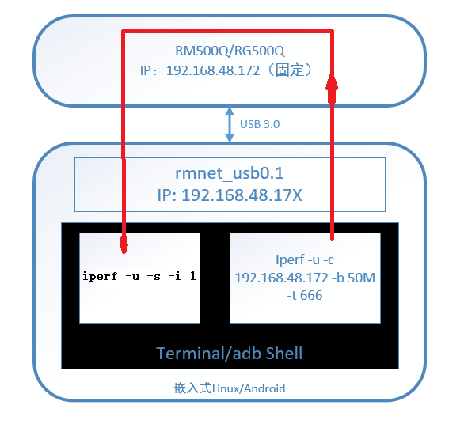
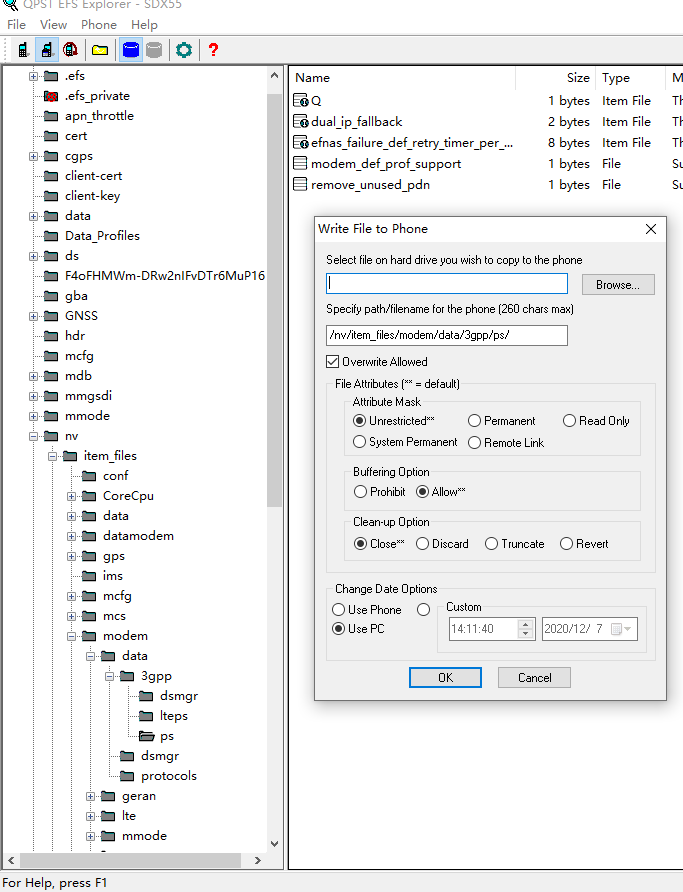
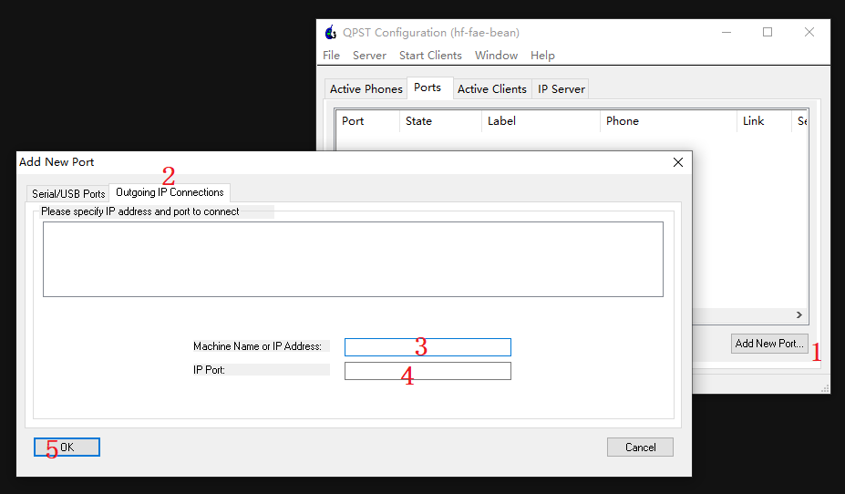

Android Loopback 网速测试
========

准备工作
-----

- 模组写loopback功能
- Android RIL库打开loopback
- 工具iperf2 mpstat等

[busybox-armv8l](https://busybox.net/downloads/binaries/1.31.0-defconfig-multiarch-musl/busybox-armv8l)
 
[iperf](https://sourceforge.net/projects/iperf2/files/)

### 模组写loopback

如果模组可以取下来连到Windows PC上，直接用QPST写即可。按照 X55_IPQ8074_rmnet网卡_loopback功能使用说明_20200707_V4.pdf

如果模块已经和AP做成PCB，无法让模块接到PC上，可以用网络转发方式，需要在AP上运行QLog，QLog内嵌tty2tcp，通过QLog -s 9000，将DM port转发到AP的9000端口上。和AP处于同一局域网的一台Windows PC上运行QPST，将loopback_config.txt 写入模组。X55_IPQ8074_rmnet网卡_loopback功能使用说明_20200707_V4.pdf 中有详细介绍。

QPST工具及其使用咨询QuectelFAE。

确认方法

	echo -ne "AT+QNVFR=\"/nv/item_files/modem/data/3gpp/ps/loopback_config.txt\"\r\n" > /dev/ttyUSB2
	kona:/data #
	kona:/data # logcat -b radio -v time | grep -rnHi "QNVFR"
	(standard input):1689:11-25 15:05:22.139 D/use-Rlog/RLOG-RIL ATC( 1006): AT< +QNVFR: 4C4F4F504241434B5F454E41424C45443A313B0D0A4C325F4C4F4F504241434B5F454E41424C45443A303B0D0A535953204D4F44453A393B0D0A5245505F464143544F523A31343B

### Android Loopback

ril库在启动过程中会调用ql-ril.conf. ql-ril.conf 的位置一般位于 /system/etc/或者/vendor/etc/, 或者根目录下的etc/（根目录下的etc/是软连接）。或者通过rillog确定ql-ril.conf的位置。

ql-ril.conf 中有一行

	support_X55_loopback=14

默认情况该行被注释掉了，打开该行。

如果以上两步完成，无意外情况，插上SIM卡（RIL拨号需要，loopback测试不会使用SIM卡流量，不需要接模组天线），Android上rmnet_usb0.1就可以获得IP

	
	rmnet_usb0.1 Link encap:Ethernet  HWaddr 16:8d:31:d6:ce:06
	          inet addr:192.168.48.171  Mask:255.255.255.248
	          inet6 addr: 8877:6655:4433:2211:d4c2:8ba3:dd8c:295a/64 Scope: Global
	          inet6 addr: fe80::148d:31ff:fed6:ce06/64 Scope: Link
	          inet6 addr: 8877:6655:4433:2211:148d:31ff:fed6:ce06/64 Scope: Global
	          UP RUNNING NOARP  MTU:1500  Metric:1
	          RX packets:1681 errors:0 dropped:0 overruns:0 frame:0
	          TX packets:121 errors:0 dropped:0 overruns:0 carrier:0
	          collisions:0 txqueuelen:1000
	          RX bytes:69544 TX bytes:5984
	
IP 地址一般是192.168.48.17X，模组的地址是192.168.48.172

Android系统性能优化
----

增大网卡待处理 skb 队列数量大小，防止网卡驱动短时间内收到 skb 过多，系统来不及处理. 

/proc/sys/net/core/netdev_max_backlog 默认1000，调整成2000

对8核cpu，将rmnet_usb0.1 分配在cpu7 上

echo 80 > /sys/class/net/rmnet_usb0.1/queues/rx-0/rps_cpus

将rmnet_usb0.1 分配在cpu6

echo 40 > /sys/class/net/rmnet_usb0/queues/rx-0/rps_cpus

cpu设置全部online，配置在最高性能

echo 1 > /sys/bus/cpu/devices/cpu7/online
echo 1 > /sys/bus/cpu/devices/cpu6/online
echo 1 > /sys/bus/cpu/devices/cpu5/online
echo 1 > /sys/bus/cpu/devices/cpu4/online
echo 1 > /sys/bus/cpu/devices/cpu3/online
echo 1 > /sys/bus/cpu/devices/cpu2/online
echo 1 > /sys/bus/cpu/devices/cpu1/online

echo performance >  /sys/bus/cpu/devices/cpu7/cpufreq/scaling_governor
echo performance >  /sys/bus/cpu/devices/cpu6/cpufreq/scaling_governor
echo performance >  /sys/bus/cpu/devices/cpu5/cpufreq/scaling_governor
echo performance >  /sys/bus/cpu/devices/cpu4/cpufreq/scaling_governor
echo performance >  /sys/bus/cpu/devices/cpu3/cpufreq/scaling_governor
echo performance >  /sys/bus/cpu/devices/cpu2/cpufreq/scaling_governor
echo performance >  /sys/bus/cpu/devices/cpu1/cpufreq/scaling_governor

写成[shell脚本](linuxloopback.sh)

[script](linuxloopback.sh)
[script](applications/linuxloopback.sh)
[script](/applications/linuxloopback.sh)
[script](\applications\linuxloopback.sh)
[script](applications\linuxloopback.sh)

check
	
	kona:/data # cat /sys/bus/cpu/devices/cpu*/cpufreq/scaling_governor
	kona:/data # cat /sys/bus/cpu/devices/cpu*/online
	

iperf2 回环测试
-----

	/data/iperf -u -c 192.168.48.172 -b 38M -t 666 

意思是
	
	-u UDP测速
	-c 192.168.48.172 客户端模式，192.168.48.172 是模块的IP
	-b UDP 测速的时候，表示灌包的带宽。 比如 loopback 测试的时候，我们用 1G 的网卡来测试，则最好灌包 66M，这样回环的数据就是 14*66M
	-t 666 测试666秒

另起一个UDP测试

	/data/iperf  -u -s -i 1
	
其中
	-s Server
	-i 时间间隔。UDP 测速，需要看 Server 显示的速率以及丢包率，丢包率高说明 Client 灌包的带宽太大。

启动以后

可以用killall iperf kill掉上面两个iperf进程

/data/busybox-armv8l  mpstat -P ALL 2

	[  3] 135.0-136.0 sec  63.3 MBytes   531 Mbits/sec   0.625 ms    0/ 4456 (0%)
	[  3] 135.00-136.00 sec  41251 datagrams received out-of-order

	07:34:00     CPU    %usr   %nice    %sys %iowait    %irq   %soft  %steal  %guest   %idle
	07:34:02     all    1.45    0.00    4.24    0.06    4.55    2.15    0.00    0.00   87.54
	07:34:02       0    2.53    0.00   12.12    0.00    0.00    0.00    0.00    0.00   85.35
	07:34:02       1    7.65    0.00    1.53    0.00    0.51    0.00    0.00    0.00   90.31
	07:34:02       2    1.05    0.00   18.95    0.00    4.21    1.05    0.00    0.00   74.74
	07:34:02       3    0.51    0.00    2.53    0.00   31.82    1.01    0.00    0.00   64.14
	07:34:02       4    0.00    0.00    0.00    0.00    0.00    0.00    0.00    0.00  100.00
	07:34:02       5    0.00    0.00    0.00    0.00    0.00    0.00    0.00    0.00  100.00
	07:34:02       6    0.00    0.00    0.00    0.00    0.00    4.00    0.00    0.00   96.00
	07:34:02       7    0.00    0.00    0.00    0.00    0.00   10.55    0.00    0.00   89.45
	[  3] 136.0-137.0 sec  63.5 MBytes   532 Mbits/sec   0.665 ms    0/ 4459 (0%)
	[  3] 136.00-137.00 sec  41317 datagrams received out-of-order

实际测试过程
-------

> 第1次 50M 带宽,理论上限速率700M

	/data/iperf -u -c 192.168.48.172 -b 50M -t 666  &
	/data/iperf  -u -s -i 1 &
	/data/busybox-armv8l  mpstat -P ALL 2

实际结果
	
	[  3] 17.0-18.0 sec  63.5 MBytes   533 Mbits/sec   0.395 ms    0/ 4449 (0%)
	[  3] 17.00-18.00 sec  41366 datagrams received out-of-order

	07:39:01     CPU    %usr   %nice    %sys %iowait    %irq   %soft  %steal  %guest   %idle
	07:39:03     all    1.52    0.06    4.36    0.00    4.49    2.15    0.00    0.00   87.41
	07:39:03       0    2.05    0.00   13.85    0.00    0.00    0.00    0.00    0.00   84.10
	07:39:03       1    1.55    0.00    8.29    0.00    2.07    0.52    0.00    0.00   87.56
	07:39:03       2    1.55    0.00   10.88    0.00    2.59    0.52    0.00    0.00   84.46
	07:39:03       3    6.97    0.00    2.99    0.00   30.85    1.49    0.00    0.00   57.71
	07:39:03       4    0.00    0.00    0.00    0.00    0.00    0.00    0.00    0.00  100.00
	07:39:03       5    0.00    0.00    0.00    0.00    0.00    0.00    0.00    0.00  100.00
	07:39:03       6    0.00    0.00    0.00    0.00    0.00    4.00    0.00    0.00   96.00
	07:39:03       7    0.00    0.00    0.00    0.00    0.00   11.06    0.00    0.00   88.94
	[  3] 18.0-19.0 sec  62.3 MBytes   522 Mbits/sec   0.646 ms    0/ 4451 (0%)
	[  3] 18.00-19.00 sec  40464 datagrams received out-of-order
	[  3] 19.0-20.0 sec  58.8 MBytes   493 Mbits/sec   0.712 ms    0/ 4460 (0%)
	[  3] 19.00-20.00 sec  38102 datagrams received out-of-order
	
> 第2次 50M 带宽, -P 10 

        /data/iperf -u -c 192.168.48.172 -b 50M -t 666 -P 10  &
        /data/iperf  -u -s -i 1 -P 10 &
        /data/busybox-armv8l  mpstat -P ALL 2

结果
	
	[ 13] 29.00-30.00 sec  7687 datagrams received out-of-order
	[  9] 29.0-30.0 sec  14.1 MBytes   118 Mbits/sec   1.679 ms    0/ 1676 (0%)
	[  9] 29.00-30.00 sec  9172 datagrams received out-of-order
	[ 11] 29.0-30.0 sec  15.8 MBytes   133 Mbits/sec   3.807 ms    0/ 1781 (0%)
	[ 11] 29.00-30.00 sec  10337 datagrams received out-of-order
	[  7] 29.0-30.0 sec  14.7 MBytes   123 Mbits/sec   2.931 ms    0/ 1851 (0%)
	[  7] 29.00-30.00 sec  9586 datagrams received out-of-order

	07:47:47     CPU    %usr   %nice    %sys %iowait    %irq   %soft  %steal  %guest   %idle
	07:47:49     all    3.00    0.06    8.50    0.00   11.56   10.25    0.00    0.00   66.62
	07:47:49       0   10.20    0.00   17.35    0.00    0.51    1.02    0.00    0.00   70.92
	07:47:49       1    5.18    0.52   17.10    0.00    1.04    0.52    0.00    0.00   75.65
	07:47:49       2    9.14    0.00   15.74    0.00    1.52    1.02    0.00    0.00   72.59
	07:47:49       3    0.00    0.00    4.33    0.00   83.17   11.54    0.00    0.00    0.96
	07:47:49       4    0.00    0.00    1.52    0.00    1.02    0.00    0.00    0.00   97.46
	07:47:49       5    0.00    0.00    0.50    0.00    0.50    0.50    0.00    0.00   98.51
	07:47:49       6    0.00    0.00    2.05    0.00    0.51   14.87    0.00    0.00   82.56
	07:47:49       7    0.00    0.00    9.72    0.00    1.39   49.54    0.00    0.00   39.35
	[  3] 30.0-31.0 sec  9.84 MBytes  82.6 Mbits/sec   2.653 ms    0/ 1683 (0%)
	
	10个线程，速率没有提高。能看到cpu 3 出现问题了。

> 第3次 50M 带宽

	echo 80000 > /proc/sys/net/core/netdev_max_backlog 
        /data/iperf -u -c 192.168.48.172 -b 50M -t 666   &
        /data/iperf  -u -s -i 1  &
        /data/busybox-armv8l  mpstat -P ALL 2

实际结果没有改善
	

	Server listening on UDP port 5001
	Receiving 1470 byte datagrams
	UDP buffer size:  208 KByte (default)
	------------------------------------------------------------
	[  3] local 192.168.48.171 port 5001 connected with 192.168.48.172 port 37410
	[ ID] Interval       Transfer     Bandwidth        Jitter   Lost/Total Datagrams
	[  3]  0.0- 1.0 sec  62.2 MBytes   522 Mbits/sec   0.605 ms    0/33153 (0%)
	[  3] 0.00-1.00 sec  40386 datagrams received out-of-order
	[  3]  1.0- 2.0 sec  62.5 MBytes   524 Mbits/sec   0.525 ms    0/ 4446 (0%)
	[  3] 1.00-2.00 sec  40619 datagrams received out-of-order
	[  3]  2.0- 3.0 sec  62.8 MBytes   527 Mbits/sec   0.357 ms    0/ 4469 (0%)
	[  3] 2.00-3.00 sec  40852 datagrams received out-of-order
	[  3]  3.0- 4.0 sec  64.3 MBytes   539 Mbits/sec   0.637 ms    0/ 4451 (0%)
	[  3] 3.00-4.00 sec  41913 datagrams received out-of-order
	[  3]  4.0- 5.0 sec  62.4 MBytes   524 Mbits/sec   0.675 ms    0/ 4464 (0%)
		

> 第4次 50M 带宽

	echo 80000 > /proc/sys/net/core/netdev_max_backlog 
	echo 4194304 > /proc/sys/net/core/rmem_max 
	echo 4194304 > /proc/sys/net/core/wmem_max 
	echo 2097152 > /proc/sys/net/core/rmem_default 
	echo 2097152 > /proc/sys/net/core/wmem_default 
	echo 524288 2097152 4194304 > /proc/sys/net/ipv4/tcp_rmem 
	echo 524288 2097152 4194304 > /proc/sys/net/ipv4/tcp_wmem 
	echo 1 > /proc/sys/net/ipv4/tcp_window_scaling
        /data/iperf -u -c 192.168.48.172 -b 50M -t 666   &
        /data/iperf  -u -s -i 1  &
        /data/busybox-armv8l  mpstat -P ALL 2

明显有改善。值得注意的是 UDP buffer size 从上面的 208k变成了2M
	
	Server listening on UDP port 5001
	Receiving 1470 byte datagrams
	UDP buffer size: 2.00 MByte (default)
	------------------------------------------------------------
	[  3] local 192.168.48.171 port 5001 connected with 192.168.48.172 port 34559
	[ ID] Interval       Transfer     Bandwidth        Jitter   Lost/Total Datagrams
	[  3]  0.0- 1.0 sec  87.9 MBytes   738 Mbits/sec   0.610 ms 54489/117225 (46%)
	[  3] 0.00-1.00 sec  58252 datagrams received out-of-order
	[  3]  1.0- 2.0 sec  87.5 MBytes   734 Mbits/sec   0.686 ms    0/ 4455 (0%)
	[  3] 1.00-2.00 sec  57935 datagrams received out-of-order
	[  3]  2.0- 3.0 sec  87.5 MBytes   734 Mbits/sec   0.672 ms    0/ 4460 (0%)
	[  3] 2.00-3.00 sec  57966 datagrams received out-of-order

此时的CPU性能 /data/busybox mpstat -P ALL 2

	08:18:46     CPU    %usr   %nice    %sys %iowait    %irq   %soft  %steal  %guest   %idle
	08:18:48     all    2.10    0.13    4.64    0.00    4.58    2.16    0.00    0.00   86.40
	08:18:48       0    2.07    0.52   16.58    0.00    0.52    0.00    0.00    0.00   80.31
	08:18:48       1    9.84    0.00    4.15    0.00    1.04    0.00    0.00    0.00   84.97
	08:18:48       2    4.71    0.00   13.61    0.00    3.66    1.05    0.00    0.00   76.96
	08:18:48       3    0.51    1.01    3.03    0.00   31.82    1.01    0.00    0.00   62.63
	08:18:48       4    0.00    0.00    0.00    0.00    0.00    0.00    0.00    0.00  100.00
	08:18:48       5    0.00    0.00    0.00    0.00    0.00    0.00    0.00    0.00  100.00
	08:18:48       6    0.00    0.00    0.00    0.00    0.00    4.00    0.00    0.00   96.00
	08:18:48       7    0.00    0.00    0.00    0.00    0.00   10.61    0.00    0.00   89.39
	[  3] 208.0-209.0 sec  87.8 MBytes   737 Mbits/sec   0.651 ms    0/ 4474 (0%)
	[  3] 208.00-209.00 sec  58166 datagrams received out-of-order
	[  3] 209.0-210.0 sec  87.2 MBytes   731 Mbits/sec   0.577 ms    0/ 4446 (0%)
	[  3] 209.00-210.00 sec  57752 datagrams received out-of-order

从CPU利用方面看，并没有达到性能瓶颈。

> 第5次 100M 带宽

        /data/iperf -u -c 192.168.48.172 -b 100M -t 666   &
        /data/iperf  -u -s -i 1  &
        /data/busybox-armv8l  mpstat -P ALL 2
	此时UDP buffer 大写也是2M

结果是
	
	Server listening on UDP port 5001
	Receiving 1470 byte datagrams
	UDP buffer size: 2.00 MByte (default)
	------------------------------------------------------------
	[  3] local 192.168.48.171 port 5001 connected with 192.168.48.172 port 34813
	[ ID] Interval       Transfer     Bandwidth        Jitter   Lost/Total Datagrams
	[  3]  0.0- 1.0 sec   175 MBytes  1.47 Gbits/sec   0.435 ms    0/47300 (0%)
	[  3] 0.00-1.00 sec  116193 datagrams received out-of-order
	[  3]  1.0- 2.0 sec   175 MBytes  1.47 Gbits/sec   0.333 ms    0/ 8920 (0%)
	[  3] 1.00-2.00 sec  115968 datagrams received out-of-order
	[  3]  2.0- 3.0 sec   173 MBytes  1.45 Gbits/sec   0.265 ms    0/ 8920 (0%)
	[  3] 2.00-3.00 sec  114528 datagrams received out-of-order
	[  3]  3.0- 4.0 sec   172 MBytes  1.44 Gbits/sec   0.369 ms    0/ 8911 (0%)

速率稳定

	08:45:06     CPU    %usr   %nice    %sys %iowait    %irq   %soft  %steal  %guest   %idle
	08:45:08     all    3.49    0.32    7.93    0.00    7.86    3.99    0.00    0.00   76.41
	08:45:08       0    1.51    0.00   29.15    0.00   56.28    2.51    0.00    0.00   10.55
	08:45:08       1   10.15    0.00    2.03    0.00    0.51    0.00    0.00    0.00   87.31
	08:45:08       2    2.11    1.58   23.16    0.00    4.21    1.05    0.00    0.00   67.89
	08:45:08       3   15.10    0.00    8.33    0.00    1.04    0.52    0.00    0.00   75.00
	08:45:08       4    0.00    0.00    0.00    0.00    0.00    0.00    0.00    0.00  100.00
	08:45:08       5    0.00    0.00    0.00    0.00    0.00    0.00    0.00    0.00  100.00
	08:45:08       6    0.00    1.01    0.00    0.00    0.00    7.04    0.00    0.00   91.96
	08:45:08       7    0.00    0.00    0.50    0.00    0.00   20.60    0.00    0.00   78.89

可知依然没有到性能瓶颈

> 第6次 150M 带宽

        /data/iperf -u -c 192.168.48.172 -b 150M -t 666   &
        /data/iperf  -u -s -i 1  &
        /data/busybox-armv8l  mpstat -P ALL 2
	此时UDP buffer 大写也是2M

结果是

	[  3] 156.0-157.0 sec   260 MBytes  2.18 Gbits/sec   0.297 ms    0/13370 (0%)
	[  3] 156.00-157.00 sec  172506 datagrams received out-of-order

	09:00:02     CPU    %usr   %nice    %sys %iowait    %irq   %soft  %steal  %guest   %idle
	09:00:04     all    5.12    0.00    6.89    0.06   10.56    5.37    0.00    0.00   72.00
	09:00:04       0    2.58    0.00   19.59    0.00    2.58    0.52    0.00    0.00   74.74
	09:00:04       1   32.32    0.00    0.51    0.00    0.51    0.00    0.00    0.00   66.67
	09:00:04       2    0.00    0.00    0.51    0.00   78.17    2.54    0.00    0.00   18.78
	09:00:04       3    4.26    0.00   23.40    0.00    3.72    1.60    0.00    0.00   67.02
	09:00:04       4    0.00    0.00    0.00    0.00    0.00    0.00    0.00    0.00  100.00
	09:00:04       5    0.00    0.00    0.00    0.00    0.00    0.00    0.00    0.00  100.00
	09:00:04       6    0.50    0.00    0.50    0.50    0.00   10.40    0.00    0.00   88.12
	09:00:04       7    1.48    0.00   11.82    0.00    0.49   26.11    0.00    0.00   60.10

)

