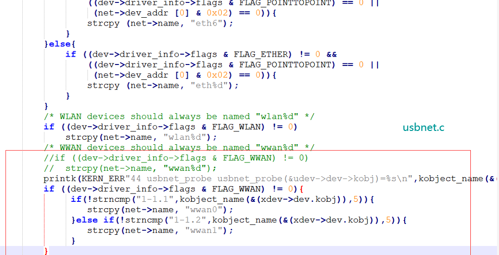

# udev can be used for

- fixed the module with the fixed device node, makes the application program more easier;

- make the hotplug possible 

# What is udev

udev是一种工具，它能够根据系统中的硬件设备的状态动态更新设备文件，包括设备文件的创建，删除等，设备文件通常放在/dev目录下。使用udev后，在/dev目录下就只包含系统中真正存在的设备。udev同时提供了监视接口，当设备的状态改变时，监视接口可以向应用程序报告发生的事件，当设备加入系统或从系统移除时都可以接到通知。

udev能够实现所有devfs实现的功能。但udev运行在用户模式中，而devfs运行在内核模式中。

作用：

-  动态创建或删除设备文件
-  遍历sysfs设备文件
-  hotplug（利用netlink）

	
## examples ##

	// https://blog.csdn.net/u012247418/article/details/80555556

	#include <unistd.h>
	#include <stdio.h>
	#include <stdlib.h>
	#include <errno.h>
	#include <signal.h>
	#include <sys/time.h>
	#include <sys/socket.h>
	#include <sys/un.h>
	#include <sys/select.h>
	#include <linux/types.h>
	#include <linux/netlink.h>
	#include <libudev.h>
	 
	 
	#undef asmlinkage
	#ifdef __i386__
	#define asmlinkage __attribute__((regparm(0)))
	#else
	#define asmlinkage 
	#endif
	 
	 
	static int udev_exit;
	 
	static void asmlinkage sig_handler(int signum)
	{
		if (signum == SIGINT || signum == SIGTERM)
			udev_exit = 1;
	}
	 
	 
	static void print_device(struct udev_device *device, const char *source, int env)
	{
		struct timeval tv;
		struct timezone tz;
		gettimeofday(&tv, &tz);
	 
		printf("%-6s[%llu.%06u] %-8s %s (%s)\n",
		       source,
		       (unsigned long long) tv.tv_sec, (unsigned int) tv.tv_usec,
		       udev_device_get_action(device),
		       udev_device_get_devpath(device),
		       udev_device_get_subsystem(device));
	 
		if (env) {
			struct udev_list_entry *list_entry;
			udev_list_entry_foreach(list_entry, udev_device_get_properties_list_entry(device))
				printf("%s=%s\n",
				       udev_list_entry_get_name(list_entry),
				       udev_list_entry_get_value(list_entry));
			printf("\n");
		}
	 
	}
	 
	 
	int udevadm_monitor(struct udev *udev)
	{
		struct sigaction act;
		int env = 0;
		int print_kernel = 1;
		struct udev_monitor *kernel_monitor = NULL;
		fd_set readfds;
		int rc = 0;
	 
		if (getuid() != 0) {
			fprintf(stderr, "root privileges needed to subscribe to kernel events\n");
			goto out;
		}
	 
		/* set signal handlers */
		memset(&act, 0x00, sizeof(struct sigaction));
		act.sa_handler = (void (*)(int)) sig_handler;
		sigemptyset(&act.sa_mask);
		act.sa_flags = SA_RESTART;
		sigaction(SIGINT, &act, NULL);
		sigaction(SIGTERM, &act, NULL);
	 
		printf("monitor will print the received events.\n");
		
		if (print_kernel) {
			kernel_monitor = udev_monitor_new_from_netlink(udev, "udev"); //这里的udev源码中没有"udev"这个参数，不加进去返回值就为NULL，所以要加这个
			if (kernel_monitor == NULL) {
				rc = 3;
				printf("udev_monitor_new_from_netlink() error\n");
				goto out;
			}
	 
			if (udev_monitor_enable_receiving(kernel_monitor) < 0) {
				rc = 4;
				goto out;
			}
	 
			printf("UEVENT the kernel uevent: \n");
		}
		
		printf("\n");
		while (!udev_exit) {
			int fdcount;
			FD_ZERO(&readfds);
	 
			if (kernel_monitor != NULL)
				FD_SET(udev_monitor_get_fd(kernel_monitor), &readfds);
	 
			fdcount = select(udev_monitor_get_fd(kernel_monitor)+1, &readfds, NULL, NULL, NULL);
			if (fdcount < 0) {
				if (errno != EINTR)
					fprintf(stderr, "error receiving uevent message: %m\n");
				continue;
			}
	 
			if ((kernel_monitor != NULL) && FD_ISSET(udev_monitor_get_fd(kernel_monitor), &readfds)) {
				struct udev_device *device;
				device = udev_monitor_receive_device(kernel_monitor);
				if (device == NULL)
					continue;
				print_device(device, "UEVENT", env);
				udev_device_unref(device);
			}
	 
		}
	 
	out:
		udev_monitor_unref(kernel_monitor);
		return rc;
	}
 
 
	 
	int main(int argc, char *argv[])
	{
		struct udev *udev;
		int rc = 1;
	 
		udev = udev_new();
		if (udev == NULL)
			goto out;
	 
		udevadm_monitor(udev);
		goto out;
		rc = 2;
	 
	out:
		udev_unref(udev);
		return rc;
	}

sudo apt-get install libudev-dev

gcc -o udevhotplug udev-hotplugin.c -ludev

执行 sudo ./udevhotplug

	UEVENT[1602138821.525661] add      /devices/pci0000:00/0000:00:14.0/usb2/2-2 (usb)
	UEVENT[1602138821.535415] add      /devices/pci0000:00/0000:00:14.0/usb2/2-2/2-2:1.0 (usb)
	UEVENT[1602138821.537373] add      /bus/usb/drivers/usb-storage (drivers)
	UEVENT[1602138821.538341] add      /module/usb_storage (module)
	UEVENT[1602138821.538686] add      /bus/usb/drivers/uas (drivers)
	UEVENT[1602138821.540910] add      /module/uas (module)
	UEVENT[1602138821.546051] bind     /devices/pci0000:00/0000:00:14.0/usb2/2-2 (usb)
	UEVENT[1602138821.548524] add      /devices/pci0000:00/0000:00:14.0/usb2/2-2/2-2:1.0/host4 (scsi)
	UEVENT[1602138821.550606] add      /devices/pci0000:00/0000:00:14.0/usb2/2-2/2-2:1.0/host4/scsi_host/host4 (scsi_host)
	UEVENT[1602138821.553391] bind     /devices/pci0000:00/0000:00:14.0/usb2/2-2/2-2:1.0 (usb)
	UEVENT[1602138824.818891] add      /devices/pci0000:00/0000:00:14.0/usb2/2-2/2-2:1.0/host4/target4:0:0 (scsi)
	UEVENT[1602138824.821252] add      /devices/pci0000:00/0000:00:14.0/usb2/2-2/2-2:1.0/host4/target4:0:0/4:0:0:0 (scsi)
	UEVENT[1602138824.823607] add      /devices/pci0000:00/0000:00:14.0/usb2/2-2/2-2:1.0/host4/target4:0:0/4:0:0:0/scsi_device/4:0:0:0 (scsi_device)
	UEVENT[1602138824.824752] add      /devices/pci0000:00/0000:00:14.0/usb2/2-2/2-2:1.0/host4/target4:0:0/4:0:0:0/scsi_disk/4:0:0:0 (scsi_disk)
	UEVENT[1602138824.825099] add      /devices/pci0000:00/0000:00:14.0/usb2/2-2/2-2:1.0/host4/target4:0:0/4:0:0:0/bsg/4:0:0:0 (bsg)
	UEVENT[1602138824.825470] add      /devices/pci0000:00/0000:00:14.0/usb2/2-2/2-2:1.0/host4/target4:0:0/4:0:0:0/scsi_generic/sg2 (scsi_generic)
	UEVENT[1602138824.836199] add      /devices/virtual/bdi/8:32 (bdi)

## udev to make the ttyUSB fixed##

可以通过添加udev规则的方式。譬如，接上EC25模组，希望驱动加载后，生成的端口固定。

创建文件 /etc/udev/99-quectel-EC25.rules 内容如下

99-quectel-EC25.rules

<pre><code>
	SUBSYSTEMS=="usb", ENV{.LOCAL_ifNum}="$attr{bInterfaceNumber}"
	
	SUBSYSTEMS=="usb", KERNEL=="ttyUSB[0-9]*", ATTRS{idVendor}=="2c7c", ATTRS{idProduct}=="0121", ENV{.LOCAL_ifNum}=="02", SYMLINK+="EC21.AT", MODE="0660"
	SUBSYSTEMS=="usb", KERNEL=="ttyUSB[0-9]*", ATTRS{idVendor}=="2c7c", ATTRS{idProduct}=="0121", ENV{.LOCAL_ifNum}=="03", SYMLINK+="EC21.MODEM", MODE="0660"
	
	SUBSYSTEMS=="usb", KERNEL=="ttyUSB[0-9]*", ATTRS{idVendor}=="2c7c", ATTRS{idProduct}=="0125", ENV{.LOCAL_ifNum}=="01", SYMLINK+="EC25.NMEA", MODE="0660"
	SUBSYSTEMS=="usb", KERNEL=="ttyUSB[0-9]*", ATTRS{idVendor}=="2c7c", ATTRS{idProduct}=="0125", ENV{.LOCAL_ifNum}=="02", SYMLINK+="EC25.AT", MODE="0660"
	SUBSYSTEMS=="usb", KERNEL=="ttyUSB[0-9]*", ATTRS{idVendor}=="2c7c", ATTRS{idProduct}=="0125", ENV{.LOCAL_ifNum}=="03", SYMLINK+="EC25.MODEM", MODE="0660"

</code></pre>

这样插入EC25模组后，会自动生成链接，即使ttyUSB*已经出错了。用户应用程序可以适用/dev/EC25.AT、/dev/EC25.MODEM、/dev/EC25.NMEA

----------

## udev实现插入模组自动拨号

只说明插入USB模组后，自动执行quectel-CM拨号，其他网卡接口同理。

同理，

	SUBSYSTEMS=="usb", ENV{.LOCAL_ifNum}="$attr{bInterfaceNumber}"
	
	SUBSYSTEMS=="usb", KERNEL=="ttyUSB[0-9]*", ATTRS{idVendor}=="2c7c", ATTRS{idProduct}=="0125",RUN+="/usr/bin/quectel-CM &" , MODE="0660"

## mdev

mdev是busybox中的一个udev管理程序的一个精简版，他也可以实现设备节点的自动创建和设备的自动挂载，在实现的过程中有点差异，在发生热插拔时间的时候，mdev是被hotplug直接调用，这时mdev通过环境变量中的 ACTION 和 DEVPATH，来确定此次热插拔事件的动作以及影响了/sys中的那个目录。接着会看看这个目录中是否有“dev”的属性文件，如果有就利用这些信息为这个设备在/dev 下创建设备节点文件。

## change the NetWork Interface name

Normally there are two possible ways.

> Modify the driver source code

- 5G qmi_wwan_q
	
	
	qmap_register_device
	...
	#if 0 //ANDROID/system/netd/server/NetdConstants.cpp:isIfaceName() do not allow '.'
	    sprintf(qmap_net->name, "%s_%d", real_dev->name, offset_id + 1);
	#else
	    sprintf(qmap_net->name, "%s.%d", real_dev->name, offset_id + 1);
	#endif
	

- fixed with the fixed hub port 

If you fixed the module with the fixed hub port, the sysfs path might be fixed.

One excellent found that. So he fixed the module with the hub port by modifying the usbnet.c.

As this way.

> udev

touch a rules in /etc/udev/rules.d

Contents can be:
	
	SUBSYSTEM=="net", ACTION=="add", DRIVERS=="qmi_wwan_q",  ATTR{type}=="1", KERNEL=="rmnet_usb*", NAME="usb0" 

## 参考文档

http://blog.chinaunix.net/uid-20506382-id-1939795.html

