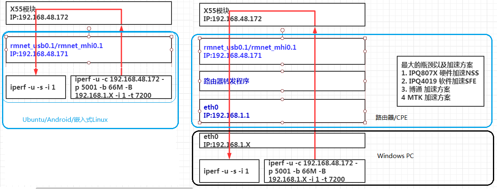

回环测试
=====

## 目的和原理

5G模组的loopback测试，指的是上位机通过网卡发送数据给模块，模块可以回环给上位机的。
X55支持rmnet网卡的loopback。Rx500U一般在RNDIS网卡下做loopback。 
而且可以定义回环倍数，假设是7倍，效果是发10M的数据给模块，模块回环70M的数据给主控。 
 
5G 的速率非常高，客户的 AP 必须正确的配置之后(比如 CPU 的负载平衡，软件/硬件加速方案等等)，才能测到最高的速率。 
Loopback 测试不需要插 SIM 卡(也就是不需要实网)，也不需要仪器，非常方便测试/调试 AP 的性能。 
建议客户在做实网和仪器 TPUT 之前，都先做 loopback 测试.

## 高通5G

- 使能loopback

	通过QPST传文件，详见文档 AT+QNVFR="/nv/item_files/modem/data/3gpp/ps/loopback_config.txt"
	quectel-Cm -l 回环倍数

- iperf2 打流

	iperf -u -s -i 1
	iperf –u –c 192.168.48.172 –b 180M –t 72000

## 展锐5G

- 使能loopback

	echo 10 > /proc/net/sfp/loopback_enable    /*拷贝份数,0为关闭, >0为开启, 1-15为取值范围*/
	at+qcfg="loopback",10

- RNDIS
	at+qcfg=”usbnet”,3		//设置usb网卡为rndis模式
	at+qcfg=”nat”,1	

- iperf2

	iperf -s -u -w 2048k -i 1 -p 5001
	iperf -c 192.168.0.1 -u -b 200m -p 5001 -P 1 -i 1 -t 60 

## Android

ql-ril.conf 中添加

	support_X55_loopback=回环倍数

## FAQ

### 性能方面

- 网卡队列/中断

支持NSS的主控

- mpstat
- CPU性能
- TCP/UDP窗口大小

### 其他常见

- 没跑起来

	禁用其他网卡
	iptables -F
	iptables -nat F
	iperf版本不对，不支持iperf3

- 模块侧的ip地址是固定

	iperf 打流选择的server IP是固定的。

## ref

[Kernel Doc: SMP IRQ affinity](https://www.kernel.org/doc/html/latest/core-api/irq/irq-affinity.html)
